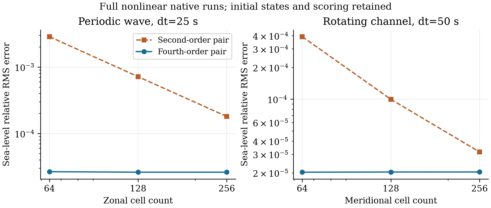

# 成对压力与连续性算子的通道试验

ZhenMode 的成对四阶空间模板在相同初态和评分下改善了热成风：海面相对误差从
0.002116307 降到 0.0006686848，温度误差从 0.0001302487 °C 降到
0.00003359612 °C。固定时间步的旋转波和周期驻波也有改善，但继续加密后误差
不再明显下降。该选项保留为受限通道候选，原生产预设和默认算子不变。

## 诊断与修改

旧通道初态的压力／科氏合力 RMS 为 1.889209857×10⁻⁸ m/s²。
600 s 短窗中，dt 从 50 s 减至 25 s 和 12.5 s，最大海面变化分别为
3.039565×10⁻⁵、3.038984×10⁻⁵、3.038840×10⁻⁵ m；去掉密度中性示踪扰动后，
速度和海面响应也几乎相同。这些开发诊断支持先处理空间离散失衡。
独立 NumPy 计算直接积分线性密度律，复现旧初始合力并预测新值
3.560008972×10⁻⁹ m/s²；实际核心采用新算子后得到同一量级和值。

`pressure_continuity_scheme='centered_fourth'` 同时修改压力梯度和通量插值。
正面速度由相邻一对的 7/12 减去外侧一对的 1/12 构造，其面通量差给出四阶
中心导数。标量使用同号镜像，法向速度使用反号镜像，压力梯度与连续性互为
负伴随。垂向速度和温盐平流使用同一面通量，避免只提高压力梯度而改变能量或
常量示踪物的闭合关系。梯度先取相邻差值，再组合系数，以严格消去方向常量；
首版加权值表达式在 10⁶ 压力偏置下的非零导数由独立检查发现并修正。

工厂要求已验证的 `closed_faces`、全湿平底笛卡尔通道、对称外模、零混合和零
底拖曳，拒绝投影平流，并要求两个水平方向各至少五个格点。动量平流、示踪重建
和垂向输运仍保留原阶数；温度锋面肩部也只有有限光滑性，因此不能称完整模式四阶。
原解析初态、全部评分格点、权重及阈值均保留。诊断中构造的离散平衡速度只用于
定位误差，没有替换正式初态或评分参考。

## 实际 GPU 对照

正式比较包含九个新选项运行和两个同包旧选项控制，全部完成并通过原有筛选。
功能源码为 `e4d2a0fd629c12e01857b81c030cf9afda6339a6`，每个收据都包含新增算子
文件的实际 SHA256。同包细网格旋转波和热成风旧控制的初态与新控制相同，
全部原生数组复现了上一轮二阶通道结果。表中的旧粗／中网格值来自上一轮记录。

| 算例 | 旧海面相对误差 | 新海面相对误差 | 缩小倍数 |
| --- | ---: | ---: | ---: |
| 周期波 nx=64，dt=25 s | 0.002859448 | 0.00002661561 | 107.4 |
| 周期波 nx=128，dt=25 s | 0.0007146009 | 0.00002616110 | 27.32 |
| 周期波 nx=256，dt=25 s | 0.0001800852 | 0.00002617214 | 6.881 |
| 旋转波 ny=64，dt=50 s | 0.0003913442 | 0.00002028972 | 19.29 |
| 旋转波 ny=128，dt=50 s | 0.00009957615 | 0.00002037114 | 4.888 |
| 旋转波 ny=256，dt=50 s | 0.00003159144 | 0.00002039125 | 1.549 |



驻波另外两个 nx=256 控制的 dt 为 50 s 和 100 s，海面相对误差分别为
0.00002622793 和 0.00002711992。周期波和旋转波的空间曲线都出现误差下限；
旋转波的三个值甚至随加密略增。固定时间步误差、非线性积分相对于线性参考的
差异及其他低阶过程尚未分离，不能据此宣称空间收敛阶或继续加密必然改善。

| 热成风指标 | 二阶通道 | 成对四阶通道 |
| --- | ---: | ---: |
| 海面相对误差 | 0.002116307 | 0.0006686848 |
| u 相对误差 | 0.001618895 | 0.0003082170 |
| v 相对误差 | 0.001028017 | 0.0001969914 |
| 温度误差，°C | 0.0001302487 | 0.00003359612 |
| 盐度误差，psu | 0.000009318822 | 0.000006803831 |
| 温度库存相对变化 | 2.4259×10⁻¹¹ | 3.1737×10⁻¹² |

热成风海面、u／v、温度、盐度误差分别缩小约 3.165、5.252／5.219、3.877、
1.370 倍。温盐改善幅度不同，仍需单独分析密度相关变化和密度中性示踪物的输运。
九个新选项运行各保存 33 个瞬时时刻，北边界实际面通量为零，生产算子的南侧
入通量也为零；积分质量倾向相对残差最大为约 5.04×10⁻¹⁷。该检查覆盖保存时刻。

## 检查与来源

243 项有界 CPU 检查通过，包含光滑模态的四阶导数关系、两端墙面离散符号、
随机场负伴随与质量控制、常量示踪物、故意混用阶数的反例、压力偏置零导数、
严格重启，以及全部架构／源码身份检查。核心限制仍是理想化通道，不构成工业资格
或速度比较；这些数据受到此前结果和诊断的选择影响，属于开发证据。

首版另完成了 11 次探索运行，但遗漏新增文件的源码登记；第二批稳定表达式运行
也在登记修复前中断。这些文件全部保留，并排除出正式比较。正式 11 次运行来自
登记完整的新 wheel 和仓库外干净安装，采用 RTX 4060 Laptop、CUDA、float64，
每次受 1 CPU／600 s／4 GiB 采样进程组 RSS 预算约束。
[数值、对照和哈希](data/channel_pressure_20261011.json)包含正式收据及排除说明；
原始正式输出位于 `outputs/thermal-balance-20261010/final/`。

```bash
zhenmode benchmark channel --case thermal-wind --method fourth-order-channel \
  --models zhenmode --output NEW_THERMAL \
  --source-revision e4d2a0fd629c12e01857b81c030cf9afda6339a6
zhenmode benchmark channel --case geostrophic-adjustment --level fine \
  --method fourth-order-channel --models zhenmode --output NEW_ROTATING \
  --source-revision e4d2a0fd629c12e01857b81c030cf9afda6339a6
zhenmode benchmark standing-wave --study 256 25 --method fourth-order-channel \
  --models zhenmode --output NEW_WAVE \
  --source-revision e4d2a0fd629c12e01857b81c030cf9afda6339a6
```
