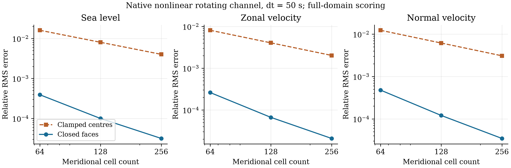

# 封闭边界面的速度表示

ZhenMode 在平底旋转通道中保留墙边格点速度后，细网格海面相对误差从
0.004016399 降到 0.00003159144，缩小约 127 倍。五组沿周期方向传播的驻波
全部原生数组与上一批结果相同；分层热成风的海面误差略增 0.168%，
仍通过原有筛选。这项修改作为独立选项保留，生产预设继续采用原处理。

## 算子处理

旧处理既关闭南北外边界面通量，又将第一行和最后一行格点的法向速度清零。
这些格点位于墙内半个网格间距处。新选项
`meridional_boundary_scheme='closed_faces'` 保留全部湿格点速度，只在外边界面
施加零通量。压力与连续性继续使用现有互为负伴随的算子；外模的平均科氏旋转
覆盖全部湿格点，垂向切变仍单独旋转一次。法向动量的平流导数及其五点滤波
使用反号镜像，标量和切向动量保留原有同号处理。

目前工厂仅接受对称外模、非分裂时间组织、`nodal_dual_v1`、全湿平底笛卡尔通道、
零混合系数和零底拖曳的组合，并拒绝极区滤波及动态海冰。海岸、变海深、混合和
全球预设需要各自的验证。原 `clamped_nodes` 默认路径以及旧协议定义保留。

## 旋转通道

三个分辨率使用相同 dt=50 s、32,000 s 时长及原有线性旋转波参考。
误差按全部原生格点、原生三维速度体积权重和时间梯形权重计算；没有删去墙边行。
旧值来自上一批对称外模，新值来自本批完整非线性 GPU 积分。

| ny | 旧海面相对误差 | 新海面相对误差 | 新 u 相对误差 | 新 v 相对误差 | 海面误差缩小倍数 |
| ---: | ---: | ---: | ---: | ---: | ---: |
| 64 | 0.01607000 | 0.0003913442 | 0.0002609556 | 0.0004781623 | 41.06 |
| 128 | 0.008033182 | 0.00009957615 | 0.00006630786 | 0.0001205745 | 80.67 |
| 256 | 0.004016399 | 0.00003159144 | 0.00002073733 | 0.00003458715 | 127.1 |



新海面误差随两次加密分别缩小 3.930 和 3.152 倍。固定时间步的完整非线性积分
还包含时间误差及相对于线性参考的差异，不能据这三个数认定整个模式具有二阶精度。
此前线性诊断只用于选择修改；上述结果来自实际 ZhenMode，不再是替代矩阵积分。

细网格另在同一安装包中复跑旧选项，初态的六个状态数组完全相同，复跑的全部
原生输出数组也与上一批旧结果完全相同。这个比较支持本次边界选项造成误差改善，
但尚未逐项分离格点约束、反号导数和法向滤波的贡献。历史细网格 MOM6 和
Oceananigans 海面误差分别为 0.002026978 和 0.000504327；本批没有复跑两者，
这些数仅是同算例的历史参照。各模式保留原生垂向离散，MOM6 的历史完整构建收据
仍有缺口，因此不能把本算例排序扩展为一般模式优劣。

## 驻波与分层控制

驻波采用既有五个空间／时间组合：64/25、128/25、256/25、256/50、256/100
（nx／dt 秒）。与上一批逐数组核对 `native.npz` 后，五个运行中的时间、坐标、
垂向厚度、海面、三维速度和温盐数组均完全相同；既有全域评分也相同。
这个沿周期方向传播、f=0 的控制支持该场景的回归一致性。

热成风运行 86,400 s，保留分层和密度中性的温盐示踪波。旧选项也在同一安装包内
复跑，初态相同且全部原生数组复现上一批旧结果。海面误差从 0.002112761 增至
0.002116307（相对增加 0.168%）；u／v 误差分别从 0.001618895／0.001028010
变为 0.001618895／0.001028017。温度误差从 0.000130248956 °C 变为
0.000130248712 °C，盐度误差从 0.000009318788 psu 变为 0.000009318822 psu。
温度库存相对变化仍为 2.4259×10⁻¹¹，全部指标通过既有阈值。
因此边界修改明显改善旋转波，却没有解决热成风的主导误差。

九个新选项运行各保存 33 个瞬时时刻。北侧实际返回的面通量均为零，南侧入通量
由生产连续性算子设为零；积分散度相对于绝对散度总和的最大残差小于 4.7×10⁻¹⁷。
细网格旋转波墙边格点的最大 |v| 为 1.6645×10⁻⁵ m/s，表明通量关闭没有再次
清零这些格点。收据中的检查覆盖保存时刻，未逐步记录每个接受步。

## 验证与复跑

本批共 11 个 CUDA 原生运行：九个新选项运行，以及观察结果后追加的两个同包旧选项
控制。它们都是开发数据；上一批结果和线性诊断参与了选项选择。解析离散正弦／余弦
控制、随机场伴随与质量控制、反号镜像、完整状态严格重启及入口／评分回归等
142 项有界 CPU 检查通过。这些控制共享方程和部分离散假设，不构成独立工业资格认证。

实际积分来自仓库外安装的 wheel，功能代码提交为
`cd1ee3c3a0d496c2df48005c9bda4b26dc1b4079`，使用 RTX 4060 Laptop、JAX CUDA
和 float64。每个原生运行受 1 CPU／600 s／4 GiB 采样进程组 RSS 预算约束。
预算不是硬 cgroup 内存上限；本批不作性能比较，诊断编译和调用也会影响计时。
[完整数值及文件哈希](data/closed_faces_20261010.json)包含 11 个运行收据、wall diagnostics、
同包比较和历史来源；原始输出位于 `outputs/closed-faces-20261010/`。

```bash
zhenmode benchmark channel --case geostrophic-adjustment --level fine \
  --method symmetric-closed-faces --models zhenmode --output NEW_ROTATING \
  --source-revision cd1ee3c3a0d496c2df48005c9bda4b26dc1b4079
zhenmode benchmark standing-wave --study 256 25 \
  --method symmetric-closed-faces --models zhenmode --output NEW_WAVE \
  --source-revision cd1ee3c3a0d496c2df48005c9bda4b26dc1b4079
zhenmode benchmark channel --case thermal-wind \
  --method symmetric-closed-faces --models zhenmode --output NEW_THERMAL \
  --source-revision cd1ee3c3a0d496c2df48005c9bda4b26dc1b4079
```
