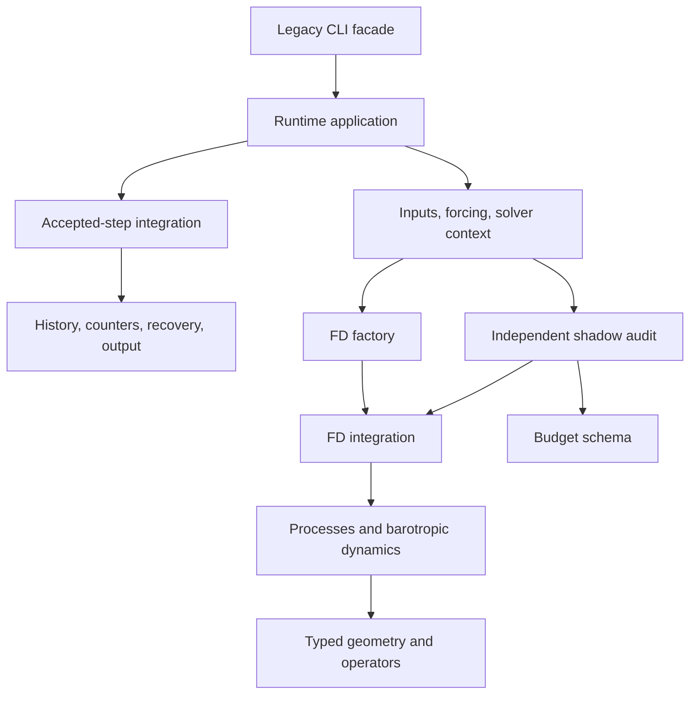

# Production modularization

## 2026-10-02 — first extraction

The immutable comparison source is main `4bcb3e4002a4b276ac740d5768eb26d965bb77e1`. Historical manifests and research reports remain at their original source identity.

The first extraction moves FD state/parameter types, geometry construction, horizontal and vertical operators, EOS, pressure, transport, projection, and CFL calculation into `ocean_solver.fd`. Pure grid types and nodal thickness live in `ocean_solver.geometry`; the budget schema is independent of solver assembly in `ocean_solver.audit.schema`. Legacy flat modules directly re-export the same objects. Namedtuple field order, defaults, pickle module names, and JAX pytree behavior are preserved.

A fresh source registry includes every new package module. Current production and material restart contracts hash actual relocated execution files; a modified or missing new leaf is rejected. Earlier strict-source restarts require their historical commit. No hash is substituted to make old contracts appear compatible.

Validation uses the project-local inherited Python 3.12.14 environment, JAX/JAXlib 0.11.2, NumPy 2.5.3, CPU backend. The bounded runner enforces one CPU, 180 seconds, and 4 GiB per invocation. `scripts/capture_modularization_state.py` records a synthetic nonzero 8×4×6 full-state run, independently audited shadow states/ledgers, rejected-state rollback, restart round-trip, factory arities, and operator outputs. This is a refactoring equivalence witness, not a physical qualification or accuracy claim.

| Check | Immutable reference | First extraction |
| --- | --- | --- |
| Full numerical/interface payload | 275 records | All 275 have identical dtype, shape, and bytes |
| Bounded capture wall time | 30.438 s | 33.343 s |
| Peak interpreter RSS | 461,897,728 bytes | 461,189,120 bytes |
| Peak job private memory | 441,151,488 bytes | 440,557,568 bytes |

Representative real JAX heat ledger, genuine internal diffusion fault, and invalid-timestep refusal checks passed before and after (6 baseline tests; 9 after including type/API and packaging checks). Three dedicated modularization contracts passed, including changed-source restart refusal and missing-source refusal. The existing environment emitted a NumPy binary-size warning on the restart fixture; numerical captures and checks completed successfully.

Reproduction from the repository root (local environment with the above dependencies):

```powershell
python scripts/run_bounded_research_tests.py --module scripts.capture_modularization_state --source-root src --output logs/code_cleanup/current_legacy.npz
python scripts/run_bounded_research_tests.py tests/test_modularization_contracts.py -q
```

Reference arrays and source snapshots are ignored local validation artifacts. No private model input, archive array, filesystem path, or secret is committed. The default production method and CLI remain unchanged. Driver orchestration and the remaining solver process/step/factory decomposition are subsequent units; this entry does not claim that larger refactor is finished.

## 2026-10-02 — process, integration, factory, and audit extraction

The remaining 29 solver definitions move into subcycles, closures, sources, barotropic dynamics, processes, integration, factory, and manufactured-solution validation. Both closure constants retain their original values. `material_top` consumes canonical execution modules; `audit.stages` records the actual integration step without a core-to-audit dependency. Legacy solver and budget modules directly re-export these implementations. Independent review confirms all 95 extracted definitions/assignments match immutable main AST, the dependency graph is acyclic, and the registry covers all 27 package files. Existing private fault tests now patch the production process/factory globals and still detect injected diffusion and preconstruction violations.

All 275 records in each of legacy float64, legacy float32, and symmetric_fast_v3 float64 match their immutable-reference captures by dtype, shape, and bytes. Ten real JAX targeted contracts passed in 38.43 seconds (bounded wall 39.187 seconds, RSS 667,615,232 bytes). Captures executed concurrently, each with its own one-CPU bound; elapsed times are validation receipts, not speed comparisons. No production default or physical method changed. Driver configuration, forcing, and records remain the next unit.

## 2026-10-02 — production runtime decomposition and final local gates

The production driver now assembles a `RunConfiguration`, `GridInputs`, `ForcingBundle`, `SolverAssembly`, and `RunContext`, then invokes a separate accepted-step loop. CLI defaults and validation live in `runtime.cli`; selected inputs and grid/initial-state setup in `runtime.inputs`; loading/provenance and runtime dispatch in `runtime.forcing`; independent NumPy/JAX calendar controls in `runtime.seasonal`. `SnapshotHistory`, `RunCounters`, `AcceptedLedger`, `OutputManifest`, and `RecoveryContext` explicitly own records and recovery. Snapshot, rejected-state, checkpoint, and final-output responsibilities are separate modules. The legacy facade binds loader, solver, audit, and identity services at invocation, so existing controlled failures reach the implementation rather than an unused alias.



Independent review compares relocated helpers and normalized orchestration AST with `ca39fd4`/immutable main, including operation order, rejection checks, checkpoint contents, frozen CLI parsing, and output keys. The historical NPZ schema and ordered configuration dictionary remain unchanged. Fifteen helper definitions are exact AST moves; input-file and source-identity helpers are explicit adapters. The package graph is acyclic, FD execution has no runtime dependency, and every one of the 43 package files is registered. Current source contracts contain 68 required actual files. Historical strict-source restarts remain tied to their original commit.

Two actual production CLI witnesses run continuous trajectories and two controlled interruptions/restarts, both with independent stage audit, streamed T/u/v/S snapshots, and term snapshots. After strengthening the receipt tool, 344 records per NumPy-dispatch/JIT-dispatch witness match the immutable source by dtype, shape, and bytes. This includes full state/history/cumulative checkpoint arrays, checkpoint step/counters/output manifest/contract semantics, output schemas, and all snapshot files. Only declared input-path prefixes under the two isolated source parents and output-directory strings are normalized. Effective array fingerprints, selected-file checksums, relative filenames, and numerical values remain strict. Fresh code-source identities, checkpoint `contract.sources`, and their verified metadata checksums are preserved separately; no source identity is presented as unchanged.

| Gate | Result | Bounded wall / peak RSS |
| --- | --- | --- |
| NumPy-dispatch CLI candidate | Continuous plus two restarts; 344 records match | 50.734 s / 450,064,384 bytes |
| JIT-dispatch CLI candidate, serial | Continuous plus two restarts; 344 records match | 50.516 s / 452,648,960 bytes |
| CLI validation, strict/nonfinite forcing refusal, installed-source fixture | 28 passed | 4.437 s / 235,134,976 bytes |
| Genuine shadow identity/nonfinite/velocity rejection, prescribed heat, explicit forcing fallback | 6 passed | 166.860 s / 449,855,488 bytes |
| Type/pytree, three source tamper/missing paths, registry, standalone monitor defaults | 8 passed | 5.344 s / 200,216,576 bytes |
| Missing/changed retained output and exclusive-create collision | 2 passed | 8.938 s / 395,112,448 bytes |
| Equivalence tool missing-record, numeric, counter, checksum and filename controls | 5 passed | 0.719 s / 46,428,160 bytes |
| Final nonzero 8×4×6 state capture | 275 records match immutable reference | 26.828 s / 460,980,224 bytes |
| Existing manufactured-solution CLI | All checks pass, derivative convergence ratio 4.30 | 5.844 s / 188,162,048 bytes |

The installed wheel is checked against all 83 source modules, all 68 required source hashes, canonical legacy type/factory aliases, and the unchanged CLI help entry. Whole-repository Ruff and diff whitespace checks pass. No dependency was installed into the global environment; the project-local validation environment inherits the existing CPU JAX installation.

### Corrections and resource failures retained

An initial JIT candidate capture scheduled alongside other bounded CPU jobs reached the 180-second wall limit (exit 124); that partial run is not used as an equivalence result. Its serial rerun passes above. An initial subprocess import probe selected the pre-existing editable installation; explicit current-source `PYTHONPATH` fixes test isolation, and both allocation-default/override cases pass. The initial receipt collector could skip missing partner records and omitted semantic checkpoint metadata. It now requires exact record-name sets, verifies metadata checksums, and retains every semantic metadata field except code-source hashes; five negative controls validate those protections. Existing bounded raw run files were re-collected under the stronger gate without claiming a new numerical execution. The environment's NumPy binary-size warning remains a dependency-environment observation, not a hidden skipped check.

Reproduce the production runtime witness and strict comparison:

```powershell
python scripts/run_bounded_research_tests.py --module scripts.capture_driver_modularization --source-root src --output logs/code_cleanup/current_driver.npz --wind-jit
python scripts/compare_modularization_captures.py logs/code_cleanup/reference_driver.npz logs/code_cleanup/current_driver.npz --reference-source logs/code_cleanup/reference/src --candidate-source src
python scripts/run_bounded_research_tests.py tests/test_modularization_contracts.py tests/test_modularization_capture_tools.py -q
```

Create the reference source tree from commit `4bcb3e4002a4b276ac740d5768eb26d965bb77e1` and run the same capture tool against it before comparison. Local evidence files are ignored validation artifacts. These gates establish behavior preservation for the stated synthetic slices; they do not qualify industrial physics, demonstrate speedup, or establish temporal order. Existing independent research kernels and oracles are intentionally retained. Consolidation of repeated research analysis reducers and decomposition of research-only dynamic kernels remain a separate follow-up, outside this production architecture unit. Full GitHub CI must still be checked at the final pushed head before any merge.

## 2026-10-02 — delivery scope, compatibility, and source ownership

This delivery preserves the two FD commits: `9880d91` extracts types/operators/schema, and `ca39fd4` separates physical processes, integration, factory, and stage audit. The independent runtime commit separates CLI configuration, input loading, forcing/provenance/dispatch, explicit run context, accepted-step integration, record history/counters, recovery, and output. Earlier completed document-writer deletion and shared dashboard PTY drain remain secondary cleanup; they are not the main scope of this PR. Research reducer consolidation and research dynamic-kernel decomposition are still unimplemented follow-ups.

| Former ownership | Canonical ownership | Dependency direction |
| --- | --- | --- |
| Flat solver types, geometry, EOS, operators | `ocean_solver.fd.types/geometry/eos/horizontal/vertical/transport/pressure/projection/stability` | Types/geometry → operators; imports point toward dependencies |
| Flat solver physics, fast mode, full step, construction | `fd.closures/sources/subcycles/processes/barotropic/integration/factory` | Factory → integration → processes → operators |
| Flat driver parser, loading, forcing, nested loop and snapshot closures | `runtime.cli/inputs/forcing/seasonal/context/application/integration/records/recovery/output` | Application → explicit context and accepted-step loop → records/recovery/output |
| Budget schema plus full solver audit | `audit.schema` and `audit.stages` | Monitor imports only schema; audit consumes actual integration; FD never imports runtime/audit |
| Grid dataclass plus I/O | `geometry.types/columns` plus retained `grid` loading | Pure geometry has no loader dependency |
| Material mode importing private flat solver functions | Direct canonical process/integration/operator imports | Material consumes FD layers; independent numerical methods remain separate |

Compatibility is intentional and bounded. `ocean-solver`, `run_long_integration_global.main`, `jax_solver_global.make_solver_global`, legacy state/parameter/grid types, and `stage_budgets` imports remain available. Types retain historical module/pickle names, field order, constructor defaults, `_replace`, and JAX pytree behavior; factory signatures and its 3/4/5/6-value return branches remain unchanged. The old driver resolves fourteen `RunServices` dependencies when `main()` is invoked: config, grid, initialization, prescribed heat, seasonal/fixed wind, monthly/annual air, air profile, solver, stage audit, restart-contract construction, selected input paths, and source identity. Thus existing controlled driver overrides affect the actual run. Its `_input_files` and `_source_identity` adapters explicitly preserve legacy config/file-location overrides.

Flat FD re-exports do not promise arbitrary private monkeypatch forwarding. Two private fault tests now patch the actual consuming globals: `fd.processes._horizontal_tracer_diffusion` and `fd.factory.make_fd_params`. They still detect an injected internal tracer source and prove invalid polar bands are rejected before array construction. Driver tests continue exercising actual grid/forcing/factory/audit/restart hooks through services. Ordinary and shadow steps execute independently; an audited mismatch is rejected before accepted state/ledger updates.

### Package and restart identity detail

`src/source_identity.py` is the authoritative current registry. Its 24 retained production flat modules are: `run_long_integration_global`, `jax_solver_global`, `restart_contract`, `config`, `grid`, `diagnostics`, `forcing`, `wind_reanalysis`, `air_reanalysis`, `woa_data`, `benchmark_metrics`, `mixed_layer_ice`, `integration_monitor`, `runtime_validation`, `stage_budgets`, `finite_volume`, `bounded_transport`, `cgrid_momentum`, `wet_fluxes`, `physical_velocity`, `paired_dynamics`, `nonlinear_dynamics`, `barotropic_transport`, and `material_top`. Adding the registry itself and all 43 `ocean_solver` package files gives 68 production source hashes.

For precision, the earlier general statement about 68 source files describes the production contract/report. Material contracts use 50: the seven flat files `jax_solver_global`, `material_top`, `restart_contract`, `config`, `grid`, `runtime_validation`, `source_identity`, plus the same 43 package files. This is a declared conservative registry, including package initializers, audit, runtime, and MMS validation; it is not a claim of the smallest possible import closure. A package-only edit can therefore invalidate a material/research identity even when that particular path is not executed.

The wheel retains 40 flat modules and installs 43 package files (83 source modules total), using explicit `py-modules` plus `ocean_solver*` package discovery. The installed validator checks source bytes, imports every registered production module from the installed target, validates all 68 hashes, and checks legacy aliases and CLI help. Registry coverage tests compare actual package files with the list and reject duplicate names. Restart tests modify, then remove, horizontal, integration, and runtime-forcing sources: changed code rejects load and missing code rejects contract construction. Production recovery hashes real installed/checkout paths; restart schema, elapsed time, counters, outputs, and array descriptors are preserved. Old strict-source checkpoints must use their historical source commit; no old hash or source list is fabricated for compatibility.

The retained research integration's sole adjustment is expansion of its current source digest to include relocated files. Its numerical stages are unchanged. Against immutable main `4bcb3e4`, 453 tracked historical `.md/.json/.csv/.tsv/.yaml/.yml/.npz/.npy` files under `docs`, `research`, and `archive` are byte-identical. The new modularization document and research index are additive. Nine deleted Python files were completed one-off document writers; their generated historical outputs remain. Independent research methods/oracles, the license, and inherited PR22 numerical work are not rewritten by this refactor.

### Exact targeted validation inventory

All numerical invocations use the Windows bounded runner with one CPU, a 180-second wall bound, and a 4-GiB job memory bound. Final delivery checks are serial. Local receipts and synthetic arrays stay in ignored `logs/code_cleanup`; the public tools reproduce them with fresh output names.

- Baseline JAX smoke: `test_stage_budgets::test_prescribed_heat_has_independent_integrated_input`, `test_stage_budgets::test_internal_diffusion_source_is_detected_not_declared`, and parametrized `test_production_monitor::test_factory_rejects_invalid_timestep_before_constructing_arrays` (6 cases).
- FD execution gate: those cases, `test_production_monitor::test_factory_rejects_overlapping_polar_bands_before_constructing_arrays`, and the modularization contracts available at that stage (10 cases).
- Final compatibility/source/receipt gate: all of `tests/test_modularization_contracts.py` and `tests/test_modularization_capture_tools.py`, plus the four named FD smoke/refusal functions above (20 cases). This includes all three changed/missing source paths, pickle/JAX type behavior, exact registry, allocation-default override, missing partner records, signed zero/dtype differences, changed checkpoint counters, provenance checksums, and relative filenames.
- CLI refusal gate: `test_production_ledger::{test_source_hashes_survive_flat_wheel_layout,test_bathymetry_provenance_follows_offline_loader_precedence,test_strict_preflight_fails_before_loading,test_effective_nonfinite_forcing_fails_before_solver}`, all `test_production_monitor::test_invalid_cli_inputs_fail_before_loading_data`, and modularization contracts (28 cases at that stage).
- Ledger/forcing gate: all variants of `test_production_ledger::test_rejected_attempt_never_enters_ledger`, plus `test_requested_air_failure_requires_explicit_fallback` and `test_prescribed_heat_is_independent_source_not_residual` (6 cases).
- Output gate: `test_production_restart::{test_production_missing_or_changed_retained_file_is_not_silently_ignored,test_snapshot_collision_does_not_overwrite_existing_data}` (2 cases).
- Monthly-air checks: both functions in `tests/test_dynamic_air_temp.py` passed in the earlier combined run; its two failing import-isolation probes were corrected and re-run separately, as recorded above.
- `scripts.capture_modularization_state`: legacy float64/float32 and symmetric_fast_v3 float64, each 275 strict records; final representative legacy float64 capture is repeated serially before delivery.
- `scripts.capture_driver_modularization`: independent ordinary/shadow production steps, continuous versus two interrupted restarts, both NumPy and JIT dispatch; strict comparison includes 344 numerical/interface/semantic records per witness. `scripts.compare_modularization_captures` only normalizes declared path locations. Exact source records and verified envelope checksums remain in sidecars.
- `scripts.validate_installed_modularization`: actual wheel bytes, installed imports, hashes, canonical aliases, and CLI help. `jax_solver_global` executable MMS entry: existing spatial operator checks; this is not a temporal-order claim.
- Whole-repository `ruff check .` and `git diff --check`.

The JIT timeout, import-isolation correction, and receipt-collector corrections above are retained as failures/corrections, not omitted from the evidence trail. Full repository tests run in GitHub CI at the final pushed head and require the parent's separate review; targeted local checks are not presented as full CI or industrial qualification.

Dependency notation clarification: every import arrow denotes importer → dependency. In the ownership table's first row, the operator dependency is **operators → types/geometry**, not types/geometry → operators. The FD assembly order starts from types and geometry, but those leaf modules do not import operators. This clarification does not change source code.

## 2026-10-02 — final serial delivery receipts

Monthly-air failure attribution correction: the two failures in the combined run belonged to `test_modularization_contracts::test_monitor_import_preserves_runtime_default_without_solver_assembly[None]` and `[true]`. Both functions in `tests/test_dynamic_air_temp.py` passed. The standalone monitor probes were corrected to use explicit current-source import isolation and both then passed; there was no monthly-air algorithm correction.

| Fresh serial delivery gate | Result | Bounded wall / peak interpreter RSS / peak job private bytes |
| --- | --- | --- |
| Exact final compatibility/source/fault/receipt inventory above | 20 passed (pytest 41.28 s) | 42.094 s / 671,469,568 / 632,082,432 |
| Nonzero legacy float64 full-state capture | 275 records, dtype/shape/bytes equal to immutable reference | 24.219 s / 461,463,552 / 440,147,968 |
| Fresh JIT CLI continuous plus two interrupted restarts | 344 records, dtype/shape/bytes and semantic metadata equal to immutable reference | 51.531 s / 454,823,936 / 413,720,576 |
| Wheel build, no dependencies/build isolation | Successful | 2.719 s / 58,437,632 / 61,931,520 |
| Install into a new owned validation target, no dependencies | Successful | 2.328 s / 61,788,160 / 55,095,296 |
| Installed wheel bytes, all registered imports, source hashes, legacy aliases, CLI help | 83 files / 68 imports / 68 hashes pass | 1.610 s / 137,805,824 / 156,377,088 |

These final serial captures executed fresh numerical runs; they did not reuse earlier candidate run files. Both comparison tools report an empty `different_records` list. Code-source identities differ deliberately and are retained separately; only declared source/output directory locations are normalized. Field names, record sets, array shape/dtype/bytes, elapsed time, accepted/rejected counters, retained-file checksums and relative filenames, effective forcing/grid arrays, and all other semantic checkpoint metadata remain strict.

For a fresh immutable reference checkout without changing any existing worktree:

```powershell
git archive --format=zip --output=logs/code_cleanup/reference_export.zip 4bcb3e4002a4b276ac740d5768eb26d965bb77e1 src
Expand-Archive -LiteralPath logs/code_cleanup/reference_export.zip -DestinationPath logs/code_cleanup/reference_export
python scripts/run_bounded_research_tests.py --module scripts.capture_modularization_state --source-root logs/code_cleanup/reference_export/src --output logs/code_cleanup/reference_state.npz
python scripts/run_bounded_research_tests.py --module scripts.capture_modularization_state --source-root src --output logs/code_cleanup/candidate_state.npz
python scripts/compare_modularization_captures.py logs/code_cleanup/reference_state.npz logs/code_cleanup/candidate_state.npz --reference-source logs/code_cleanup/reference_export/src --candidate-source src
python scripts/run_bounded_research_tests.py --module scripts.capture_driver_modularization --source-root logs/code_cleanup/reference_export/src --output logs/code_cleanup/reference_driver.npz --wind-jit
python scripts/run_bounded_research_tests.py --module scripts.capture_driver_modularization --source-root src --output logs/code_cleanup/candidate_driver.npz --wind-jit
python scripts/compare_modularization_captures.py logs/code_cleanup/reference_driver.npz logs/code_cleanup/candidate_driver.npz --reference-source logs/code_cleanup/reference_export/src --candidate-source src
```

Use a project-local environment with the same dependency versions for both sides and new output names; the capture tools refuse existing output files. The delivery environment was Python 3.12.14, JAX/JAXlib 0.11.2, NumPy 2.5.3, pytest 9.1.1, and Ruff 0.16.8, CPU only. Run every bounded command serially. Synthetic slices are refactor regression witnesses; full CI and independent parent review remain separate gates.

Output creation clarification: the state capture uses exclusive-create for its NPZ. A fresh driver capture refuses an existing run directory, but its NPZ/sidecar writer and `--records-directory` recollection do not guarantee exclusive output-file creation. Use fresh output names and directories as instructed above; the earlier blanket statement that both tools refuse every existing output file was too broad.
