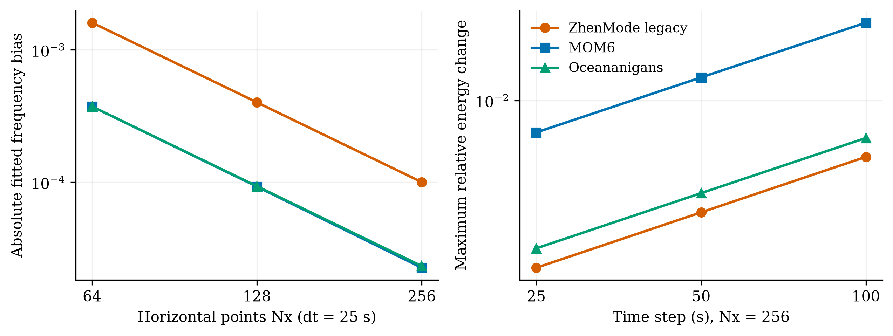
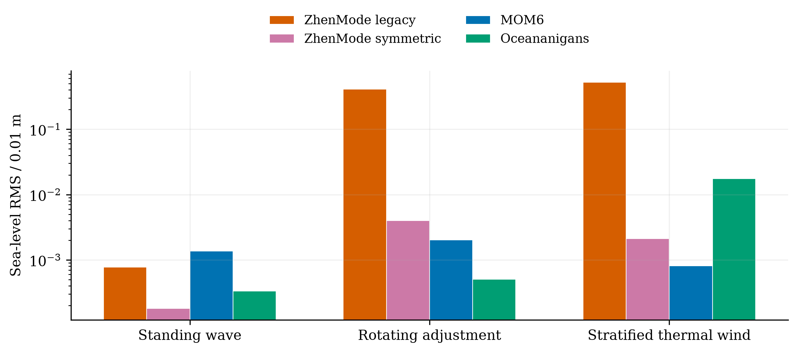

# 机制对照与外模改良实测

ZhenMode、MOM6 和 Oceananigans 已完成驻波的空间／时间分离实验、旋转地转调整、
分层热成风，以及真实天气来源的受控风应力短窗。依据这些机制实验，我们增加了
一个显式选择的对称外模方案；原生产预设和默认方案保留。本批共完成 30 个原生运行，
其中用于选方法的实验属于开发数据，适用范围仍限于已声明的问题。

## 驻波误差诊断

五个配置三方各运行一次：空间轴固定 dt=25 s，时间轴固定 nx=256，
共享 nx=256、dt=25 s。海面误差除以 0.01 m；u 为深度平均速度的归一化 RMS；
能量指标为相对初始动能与自由面势能的最大变化，频率为模态最小二乘拟合偏差。
共同问题、权重、离散差异和拟合残差定义见[分离协议](wave_space_time_zh.md)。

| nx | dt (s) | 模式 | 海面误差 | u 误差 | 能量变化 | 频率偏差 |
| --- | --- | --- | --- | --- | --- | --- |
| 64 | 25 | ZhenMode 原方案 | 0.0034131 | 0.00296486 | 0.00122671 | -0.0016063 |
| 64 | 25 | MOM6 | 0.00193258 | 0.00107365 | 0.00669896 | -0.000373596 |
| 64 | 25 | Oceananigans | 0.000571657 | 0.000774819 | 0.00156688 | -0.000373854 |
| 128 | 25 | ZhenMode 原方案 | 0.00128868 | 0.000742128 | 0.0012282 | -0.000401599 |
| 128 | 25 | MOM6 | 0.00146931 | 0.000798294 | 0.00669999 | -9.28515e-05 |
| 128 | 25 | Oceananigans | 0.000286583 | 0.000288923 | 0.00156708 | -9.34371e-05 |
| 256 | 25 | ZhenMode 原方案 | 0.00077585 | 0.000186634 | 0.00122857 | -0.000100288 |
| 256 | 25 | MOM6 | 0.00136168 | 0.000777853 | 0.00670025 | -2.26502e-05 |
| 256 | 25 | Oceananigans | 0.000332596 | 0.000225935 | 0.00156713 | -2.33178e-05 |
| 256 | 50 | ZhenMode 原方案 | 0.001386 | 0.000185409 | 0.00246015 | -9.98597e-05 |
| 256 | 50 | MOM6 | 0.00267914 | 0.00154559 | 0.0133528 | -2.04125e-05 |
| 256 | 50 | Oceananigans | 0.000684994 | 0.000437003 | 0.00313108 | -2.31398e-05 |
| 256 | 100 | ZhenMode 原方案 | 0.00260705 | 0.000180579 | 0.00493239 | -9.8036e-05 |
| 256 | 100 | MOM6 | 0.00529646 | 0.0030748 | 0.0265161 | -1.13955e-05 |
| 256 | 100 | Oceananigans | 0.00139355 | 0.000865606 | 0.00624949 | -2.24414e-05 |

固定时间步时，ZhenMode 的频率偏差随水平点数翻倍约缩小四倍；固定空间网格时，
其原方案能量变化近似随时间步线性增加。两项分别支持继续检查水平离散和外模时间推进，
不能据此认定完整非线性模式的收敛阶数。u 误差在较大 dt 时略小，提示可能存在误差抵消，
因此单独按该指标选时间步会误导。MOM6 的 nx=256、dt=100 s 能量指标超过原 2% 筛选，
该失败保留。



图中左侧是固定 dt 的频率偏差绝对值，右侧是固定 nx 的最大能量变化。
所有点读取实际 JSON，没有补点或误差条；MOM6 与 Oceananigans 的频率曲线较接近。

## 外模改动与机制结果

旧完整时间步在三维线性半步和自由面半步中都旋转了深度平均速度，造成重复的平均科氏作用。
独立惯性控制同时核对平均流和垂向剪切，定位到这两个调用。新方案让三维旋转只作用于剪切，
由外模承担平均流旋转，并采用连续性漂移、压力更新、连续性漂移及受边界约束的隐式中点旋转。
核心改动集中在 solver 的状态、工厂、外模和时间步四个文件；实验和评分职责分别保存。

新字段为 `external_mode_scheme='symmetric'`，工厂只接受非分裂、legacy 过程时间组织、
`nodal_dual_v1` 几何及零底拖曳的组合。命令通过 `--method symmetric-external-mode` 选择。
完整模式仍含原来的其他过程时间组织，外模改良不等于完整模式已取得二阶精度。

| 算例 | 方案／模式 | 海面误差 | u 误差 | v 误差 | 预置筛选 |
| --- | --- | --- | --- | --- | --- |
| 驻波细网格 | ZhenMode 原方案 | 0.00077585 | 0.000186634 | — | 通过 |
| 驻波细网格 | ZhenMode 对称外模 | 0.000180085 | 0.000186634 | — | 通过 |
| 驻波细网格 | MOM6 | 0.00136168 | 0.000777853 | — | 通过 |
| 驻波细网格 | Oceananigans | 0.000332596 | 0.000225935 | — | 通过 |
| 旋转调整细网格 | ZhenMode 原方案 | 0.412518 | 0.22288 | 0.43663 | 失败：eta_error, u_error, v_error |
| 旋转调整细网格 | ZhenMode 对称外模 | 0.0040164 | 0.00202596 | 0.00308389 | 通过 |
| 旋转调整细网格 | MOM6 | 0.00202698 | 0.00104729 | 0.00137829 | 通过 |
| 旋转调整细网格 | Oceananigans | 0.000504327 | 0.000161512 | 0.000279045 | 通过 |
| 分层热成风 | ZhenMode 原方案 | 0.524129 | 0.0045716 | 0.0150608 | 失败：eta_error, T_inventory |
| 分层热成风 | ZhenMode 对称外模 | 0.00211276 | 0.00161889 | 0.00102801 | 通过 |
| 分层热成风 | MOM6 | 0.000811566 | 0.000918871 | 0.000766419 | 通过 |
| 分层热成风 | Oceananigans | 0.0174277 | 0.000926179 | 0.000918515 | 通过 |

三类海面误差均除以预置 0.01 m；驻波 u 是深度平均量，另两类 u/v 是三维体积加权量，
速度尺度由各自物理定义预先给定。两项新 bench 是[标准测试家族的明确变体](channel_dynamics_zh.md)，
包括解析旋转调整和带密度中性温盐波的平衡热成风；没有把实际层平均和平面 FD 点值混为同一表示。



同一驻波细配置的能量最大变化从 0.0012285674 降到 1.5044596e-06，
海面误差从 0.00077584999 降到 0.00018008525；
u 误差从 0.0001866340283 变为 0.0001866340574，基本不变且略有增加。
分层实验的温度库存变化从 3.7306985e-06 降到 2.4258817e-11。
该组合结果支持继续使用新方案验证旋转和分层问题，尚不支持跨物理场景的优越性结论。

| 分层方案／模式 | 温度 RMS (°C) | 盐度 RMS (psu) | 温度库存变化 | 盐度库存变化 |
| --- | --- | --- | --- | --- |
| ZhenMode 原方案 | 0.0005509357 | 1.375954e-05 | 3.730699e-06 | 2.220446e-16 |
| MOM6 | 0.0002044105 | 2.04501e-05 | 1.110223e-16 | 2.220446e-16 |
| Oceananigans | 0.0001917147 | 5.562558e-06 | 2.220446e-16 | 2.220446e-16 |
| ZhenMode 对称外模 | 0.000130249 | 9.318788e-06 | 2.425882e-11 | 2.220446e-16 |

温盐 RMS 是相对于平衡背景与剪切平移中性波参考的绝对误差，库存变化是相对初值的最大变化。
各模式实际温盐输运都保留；这些指标同时检验非均匀标量输运和库存维持。

另用 0.005 m 振幅的中网格驻波检验新方案：海面误差 0.00071290132、
u 误差 0.00074062017、能量最大变化 6.0188173e-06，预置筛选通过。
这是同一解析家族的额外振幅验证。原方案复跑细驻波的 17 个原始数值数组逐项差值为零，
新源码身份元数据发生变化，因此没有声明整个输出文件相同。

```sh
zhenmode benchmark standing-wave --case fine --method symmetric-external-mode \
  --models zhenmode --output NEW_WAVE --source-revision ZHENMODE_COMMIT
zhenmode benchmark channel --case thermal-wind --method symmetric-external-mode \
  --models zhenmode --output NEW_THERMAL --source-revision ZHENMODE_COMMIT
```

## 真实来源风应力

真实化首先增加强迫来源：JRA55-do 1.4.0 原始天气的一个北太平洋格点，
取 1958-01-01 的 00/03/06 UTC 样本，固定水面 15°C／海流零计算 bulk 应力后作梯形平均。
实际 τx=−0.051594765985923434、τy=0.1626073148808886 N/m²；模拟全程空间与时间常量。
水域仍为规则平底通道，六小时、dt=50 s、每 900 s 保存瞬时状态，
只有风应力施加；[准备与预算定义](real_wind_control_zh.md)说明源文件核验和通量符号。

| 方案／模式 | 海面 RMS (m) | 深均 u RMS (m/s) | 深均 v RMS (m/s) | 归一化风功残差 |
| --- | --- | --- | --- | --- |
| ZhenMode 原方案 | 0.02014393 | 0.00545939 | 0.005242394 | 0.0005259006 |
| MOM6 | 0.03653599 | 0.003641311 | 0.006752477 | 0.000357179 |
| Oceananigans | 0.0366206 | 0.00364093 | 0.006764908 | 0.0006877918 |
| ZhenMode 对称外模 | 0.03659584 | 0.003654281 | 0.006764452 | 0.0007518738 |

原方案的海面和速度响应明显不同于两种对照，新方案的三项 RMS 与两种对照接近。
四个运行的体积、温度和盐度库存相对初值最大变化都小于 1e−15，预置库存筛选通过。
新方案的风功残差没有低于原方案：残差包括数值过程、表面表示及 900 秒快照积分误差，
不能全部解释为物理耗散；这里没有解析／观测响应轨迹，也没有依据 RMS 值作准确性排名。

```sh
zhenmode benchmark forced-channel --stress-file VERIFIED_STRESS.json \
  --method symmetric-external-mode --models zhenmode --output NEW_WIND \
  --source-revision ZHENMODE_COMMIT
```

## 来源与验证范围

实际 ZhenMode 与 Oceananigans 积分使用 RTX 4060 Laptop GPU、FP64；MOM6 使用一核 CPU。
原生工作进程逐个执行，设置 600 秒外层时限和 4 GiB 主机 RSS 阈值，RSS 以采样监督；
编译、准备和积分成本分别留存。
两种 GPU 模式的算法、标量数、子步和初始化成本有差异，本批不提供速度排名。
MOM6 固定作者提交 f49a000，Oceananigans 为 0.113.5／作者提交 1e8587b。
MOM6 二进制有实际哈希，但缓存的历史完整构建收据仍有缺口。

基线与候选使用各自提交安装的包，已存逐模块字节身份；驻波研究为 d69ed49，
旋转基线为 8bd1411，分层基线为 b9ffd20，对称方案验证为 226d729，风应力运行为 a8b717e。
[机器可读结果摘要](data/dynamics_bench_20261009.json)保留全部 30 个运行的指标、
输出／合同／评分文件 SHA-256、实际源码与程序身份、资源收据及筛选失败。
摘要中的 `contract_file_sha256` 哈希原始文件字节，评分器的合同哈希则使用规范化 JSON，
两种身份含义分别保留。
完整时序、初态、配置、日志和原始输出保存在本机 `outputs/dynamics-bench-20261009/`。

早期旋转运行的 FMS 诊断频率写成浮点数导致解析失败，已改用整数后在新目录重跑。
早期热成风的零源非绝热路线首步产生 NaN；单步控制确认本地缓存二进制的该路线失败，
零源绝热路线有限。最终明确启用 EOS 与温盐输运、采用 ADIABATIC=true，
符合该实验关闭非绝热源的条件。首步对照没有定位到具体 NaN 算子，不能归因于一般 MOM6 缺陷。
这些失败和资源超时日志保留，不计入 30 个完成运行。

预置控制覆盖独立解析轨迹、注入频率／振幅趋势、错误坐标／参数／来源拒绝、
惯性旋转归属、外模能量的时间步缩放、天气原始字节改动拒绝，以及风功组装的制造控制。
完整 Linux 测试与 MMS 的验证提交和实际结果在 PR 中单独注明。
真实海岸、海深、水团、海冰、混合和长期气候评价仍超出本批；本批完成的是机制量化比较、
一项有证据的模块改良和受控真实来源强迫检验。
