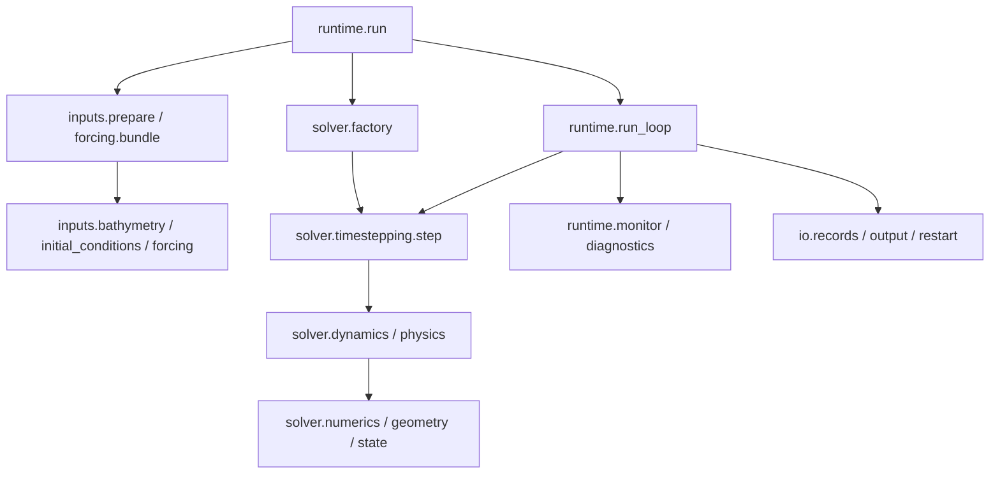

# 正式模型与产品架构

ZhenMode 的方法 ID 和 Python 包名均为 `zhenmode`。默认模型是既有全球有限差分生产方法：静力原始方程、线性自由面、快慢步协调，以及既有投影、输运和物理参数化。

逐文件职责、阅读顺序与实际运行链路见 [模型导读](../src/zhenmode/model/README.md)。本页说明模型与实验、对照、评价之间的产品边界。

```text
src/zhenmode/
├── model/                 正式模型
│   ├── config.py          配置、物理常数和通用参数约束
│   ├── verification.py    独立解析制造解与收敛检查
│   ├── solver/
│   │   ├── factory.py     系数、计算参数与编译入口组装
│   │   ├── state.py       状态、计算参数结构和状态字节身份
│   │   ├── geometry/      grid.py：网格与几何；fd_metrics.py：差分系数
│   │   ├── numerics/      后端、水平差分、垂向通量等数值工具
│   │   ├── dynamics/      动量与示踪物倾向、输运、压力、外模与投影
│   │   ├── physics/       状态方程、表面交换与海冰、垂向及等密度混合
│   │   └── timestepping/  step.py：过程积分与协调；subcycles.py：子步执行
│   ├── inputs/
│   │   ├── bathymetry.py          ETOPO 读取与网格构造
│   │   ├── initial_conditions.py WOA 初始温盐及缺失值处理
│   │   ├── sources.py            路径选择、格式识别和不可变输入快照
│   │   ├── quality.py            输入元数据与质量检查
│   │   ├── prepare.py            本次运行的初值、掩膜及参数准备
│   │   └── forcing/
│   │       ├── reanalysis.py     NCEP 风和空气温度的读取、缓存与插值
│   │       ├── seasonal.py       360 天历法与月际混合
│   │       ├── idealized.py      理想化强迫及空间分布
│   │       └── bundle.py         有效强迫、来源记录与时间调用绑定
│   ├── runtime/
│   │   ├── cli.py        命令参数、生产默认值与参数校验
│   │   ├── run.py        模型装配、恢复组织和正式入口
│   │   ├── run_loop.py   接受步循环、失败处理与输出调度
│   │   ├── monitor.py    有效性、稳定性及接受步监测
│   │   └── reporting.py  日志、进度与运行说明
│   ├── io/
│   │   ├── records.py    保存字段、历史记录及独立恢复校验
│   │   ├── output.py     输出位置、最终记录与生效配置
│   │   └── restart.py    严格 checkpoint 编解码与原子保存
│   └── diagnostics/
│       ├── snapshot.py    NumPy 状态快照诊断
│       ├── mixed_layer.py 密度阈值混合层深度
│       └── budgets.py     接受阶段的库存、通量与影子步预算
├── baselines/mom6/        对照接入、固定版本和内置小算例
├── execution/             配置展开、试验、扫参与独立 run 管理
├── evaluation/            唯一评分实现、可比性检查与报告
├── provenance/            实际源码身份和共用文件字节校验
└── cli.py                 统一命令入口
```

`prepare.py` 和 `forcing/bundle.py` 分别负责空间输入准备与时间强迫绑定，避免把输入细节塞进模型装配或数值步。输出 IO 只管理运行产物；输入数据读取集中在 `inputs`。

## 调用与依赖



`dynamics` 定义动量、连续性及示踪物输运；`physics` 描述状态方程、表面交换、海冰及未解析尺度的混合；`numerics` 提供这些过程共用的离散计算。线性半步、过程次序和快慢协调由 `timestepping` 负责。`runtime` 管整个运行的准备、接受步、故障及保存。

共用函数按职责归属。例如压力模块共用湿柱密度积分，混合过程共用 `numerics/vertical.py` 的界面通量，输出和恢复共用 `io/records.py` 的字段映射。NumPy 与 JAX 的季节计算保持独立；解析解和 NumPy 测试参考计算也保持独立。

`model` 仅依赖自身和 `provenance`，不导入对照、实验管理、评价或研究原型。MOM6 接入可以复用输入读取和网格准备；MOM6 自身的动力与时间积分来自固定上游源码，源码和编译产物放在隔离缓存。共用输入处理不自动保证物理条件可比。

## 状态与默认方法

数组使用 `(nx, ny, nz)`，经度周期、纬度有界，垂向 z 向下为负。`JaxStateG` 字段依次是 `u, v, T, S, eta, ice`：速度 m/s、温度 °C、盐度为既有 psu 表达、自由面和冰厚 m。

线性自由面使用固定参考层厚，不自动解释为 `h_top=2.5+η` 的移动材料库存。工厂保留已有 opt-in 几何与时间方案接口及其测试；它们不代表正式预设，也不改变默认生产路径。生产海冰闭合位于 `solver/physics/surface.py`；未被生产调用的 NumPy 海冰原型已从安装包移除，可从原 Git 版本获取。

## 配置、结果与来源

| 位置 | 职责 |
| --- | --- |
| `cases/` | 共同物理问题、边界、强迫、输出与数据引用 |
| `configs/<method>/presets/` | 多套来源明确的方法配置 |
| `experiments/` | 有 ID 的试验、消融和扫参定义 |
| `protocols/` | 评价版本、评分窗口、域与权重 |
| `data/`, `outputs/` | 本地输入缓存与独立运行结果，默认忽略 |
| `tests/`, `scripts/`, `docs/` | 独立验证、少量维护入口与使用说明 |

实验在运行前展开全部继承和覆盖，保存配置、数据、环境及实际执行文件身份。严格 checkpoint 校验网格、参数、强迫、执行源码及保留输出；历史 checkpoint 和旧模块路径的 pickle 应在原 Git 版本读取。内部模块迁移不安装旧路径转接层，也不替换历史 hash。

评价保留旧 raw/A2 与面积加权 v2 各自身份，外部适配要求共享网格，没有隐含重网格。执行成功、指标验收和可比性分别记录。验证与运行步骤见 [开发说明](development.md)；小例或 CI 通过不等于复现全部历史气候成绩或证明加速优势。
