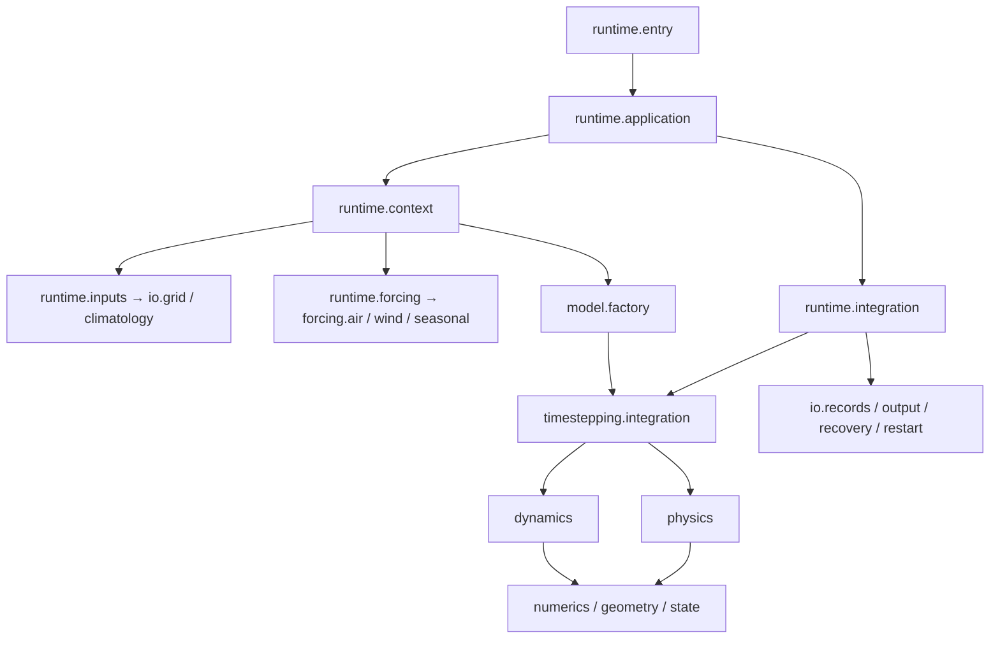

# 正式模型

方法 ID 为 `zhenmode`，Python 包为 `ocean_solver`。正式入口装配既有全球有限差分生产方法：静力原始方程、线性自由面、快慢步协调、投影及示踪物和物理过程。

## 运行流程

输入读取、时间循环和物理算子分别归属 IO、runtime 和过程模块。接受步循环管理状态、输出和恢复；`timestepping` 管理单步的过程次序与快慢步协调。

## 状态和离散约定

数组采用 `(nx, ny, nz)`。经度周期、纬度有界，垂向 z 向下为负。
`JaxStateG` 字段依次为 `u, v, T, S, eta, ice`；速度为 m/s，温度为 °C，盐度使用既有 psu 表达，自由面与冰厚为 m。

状态和网格类型使用实际所属模块名。线性自由面采用固定参考层厚语义，不自动解释为 `h_top=2.5+η` 的移动材料库存。研究候选的失败不能替代正式方法的稳定性证据。

工厂保留已有 opt-in 几何及时间方案接口，默认配置使用正式生产路径。FV/C-grid、材料库存和 r-star 原型位于独立研究包，不作为正式预设或生产依赖。

## 来源与重启

运行记录包含最终配置、数据与实际执行源码身份。严格 checkpoint 核对网格、参数、强迫及执行源码；读取旧源码生成的 checkpoint 应使用相应源码版本，不通过路径别名或 hash 替换绕过身份检查。

## 验证

算子解析检查使用 `zhenmode mms`。生产测试覆盖状态、收支、输出、恢复、来源及故障注入；步骤见 [开发说明](development.md)。数值测试和 CI 不自动证明长期气候指标或加速优势。
