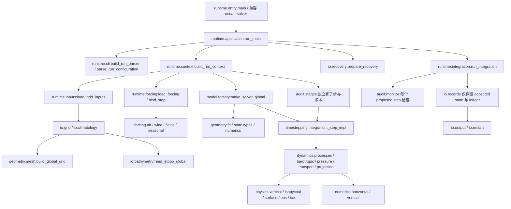

# ZhenMode 正式方法与源码职责

本次整理的基线是 `25258950905f9d1aa84509c4c99ebad9ef33ba2b`。
正式方法是既有 JAX 全球有限差分水静力原始方程生产谱系，方法 ID 为
`zhenmode`。`ocean_solver` 保留原安装包名。
默认正式运行仍经 `runtime.entry.main` 的服务组装进入原 FD 工厂和 `_step_impl`。
数值公式、状态字段、参数顺序、构造默认值及接受/拒绝步规则保持。
方法 ID 标识这条谱系；最终配置和执行来源标识一次具体运行。

## 历史依据与结论边界

`ad45c2b9673236c2a666c37a11439f1dd513abf9` 的 `_spinC_from30_ana.json`
记录约 194.7 模式年的 PASS/no_blowup；
`4dbd14fb7c224fceb118d25fbadba29a3b191a36` 的
`_ana_tmp/spinC_slope005x_analysis.json` 记录约第 192–274 年阶段 PASS。
`docs/deep-heat-poisoning-root-cause.md` 记载从约第 273 年 checkpoint
继续 52 年至累计第 325 年。这些是长期数值稳定历史记录；仍有 OHC、AMOC 警告，
不能据此声称所有气候指标合格，也不能声称同一源码从零连续运行 325 年。

`bb7ba235eed5706b0adf86472e95b46bc4c021b1` 中
`research/experiments/ice_proxy_045/benchmark_365d_repeat_manifest.json`
保留 365 天重复运行 PASS：0.45°、800×288×14、fp32、dt=1800 秒、27 个快速子步，
评分第 280–365 天，旧 raw SST RMSE 约 0.91364293°C、A2 约 1.11257074°C。
旧 raw 使用保存的 WOA 初始表层场及湿点等权，属于旧协议。
它不成为面积加权 v2 排名数据。

`23751665009c1f1a8570fc2a5f7c19c1aa14c1c2` 是
`9944bbde671080ac0828087015b03b4bd6553327` 的祖先；长期以来调用
`run_long_integration_global → make_solver_global → _step_impl`，
逐步加入投影、局地对流、受限示踪物通量和真实空气强迫。
报告提交可能晚于集群实际源码，`9944bbd` 是后来 manifest 工具提交，
不等于完整运行源码身份。本次工程回归不会冒充这些历史成绩的完整复跑。

移动材料库存候选使用 `h_top=2.5+η`，正式线性自由面没有采用这个库存解释。
候选第 353→354 步反例不否定上述生产长期轨迹；详见
`legacy_core_repair_status_zh.md` §23。PR29 不进入正式方法；其连续性残差回填
不是独立闭合证据。本次不发展替代动力核心。

## 实际调用图

`RunServices` 是应用的依赖边界；它在 `entry.main()` 调用时绑定输入、强迫、工厂、
账本与身份服务。原受控故障测试修改该服务门面，修改继续进入实际执行流程。
`runtime.integration` 管理模拟时刻、快照/检查点日程及每一步接受状态；
`timestepping.integration` 管理一整步内的线性/非线性及快慢步次序。
它们不读取 ETOPO、WOA 或 NCEP 文件。

## 文件归属与依赖

完整逐文件、逐函数映射在 [production_migrations.json](production_migrations.json)。
下表解释职责，而非用目录名自动认定所有实现为推荐配置。

| 当前实现 owner | 原 owner | 负责内容 |
| --- | --- | --- |
| `config.definitions` | `configuration` | 物理常数、不可变网格/物理定义、输入默认路径 |
| `model.factory` | `fd.factory` | 验证构造参数，预计算参数，创建状态与 JIT step；不读输入 |
| `state.types` | `fd.types` | JaxStateG、FDParams、FDPhysParams 的原字段、单位注释与 defaults |
| `geometry.types/columns` | 原处 | 网格结构与节点控制厚度；无外部输入读取 |
| `geometry.mesh` | `geometry.grid` 的纯部分 | bathymetry 数组的重采样、平滑、网格尺寸、球面 metric、湿边界 |
| `geometry.fd` | `fd.geometry` | 将实际网格转为离散位置/掩膜/差分系数 |
| `numerics.backend` | `fd.backend` | 既有 JAX x64 与预分配默认设置 |
| `numerics.horizontal/vertical` | `fd.horizontal` 与 `fd.vertical` 前五函数 | 水平/垂向导数、插值、面通量散度、过滤和扩散离散模板 |
| `numerics.stability` | `fd.stability` | 原显式水平黏性子步 CFL 计算 |
| `dynamics.pressure/transport/barotropic` | 同名 `fd.*` | 水静压力、输送/连续性、线性自由面及快速外模态 |
| `dynamics.projection` | `fd.projection` | 原柱连续性约束、实际输送修正及 CG 设置 |
| `dynamics.processes` | `fd.processes` | 动量/示踪物倾向、残差及线性过程组合；不调度整段运行 |
| `physics.eos/isopycnal/surface/vertical/ice` | `fd.eos/closures/sources/vertical` 与原 `physics.ice` | 线性 EOS、GM/Redi、表层交换、扩散系数/对流触发及原冰闭合 |
| `timestepping.integration/subcycles` | `fd.integration/subcycles` | 整步组合、快慢步与原 scan/unrolled 协调 |
| `forcing.air/wind/fields/seasonal` | `data.air/wind/forcing` 与 `runtime.seasonal` | 空气/风读取、场变换、原 30 天月历插值及 NumPy/JAX 两条已有路径 |
| `diagnostics.state/ice/runtime` | 原前两者与 `runtime.metrics` | 快照库存诊断、冰诊断、有限性与动能 |
| `audit.*` | 原处 | 输入数值校验、监测、独立阶段账本；验证层消费动力而非动力依赖研究原型 |
| `io.grid/bathymetry/climatology` | `geometry.grid/data.climatology` | 输入优先级、读取与初始场准备；geometry 只收到数组 |
| `io.data_quality/input_sources/erddap/sla/ssh` | `data.quality/sources/erddap/sla/ssh` | 输入版本/质量、快照读取与现有下载入口 |
| `io.records/output/paths/recovery/restart` | 同名 `runtime.*` 与 `provenance.restart` | 排他快照、接受历史、输出、原子 checkpoint 与来源约束 |
| `runtime.entry/application/context/inputs/forcing/integration/cli/services/identity/reporting` | 原处 | 模型运行应用、服务注入、强迫身份、调度和报告 |
| `validation.mms` 与安装后的评价组件 | 原验证/评分 owner | 解析空间误差门槛及协议评分；不反向进入物理算子 |
| `interop.mom6` 与 `baselines/mom6` | 原导出与已有脚本 | 共同 case 的外部模型输入/运行/输出契约 |

投影被放入 `dynamics`，因为约束直接使用实际柱输送及自由面；将其机械放入
`numerics` 会使下层数值工具反向依赖上层动力过程。
`dynamics.processes._linear_half_step` 保留为一组线性物理过程的组合算子，
保持真实内部扩散故障注入边界；整步时序在 `timestepping`，运行循环在 `runtime`。
水平 stencil 模块同时持有相同面模板的扩散表达式，以保持离散共用边界，
不为每个几行公式再加一个模块。

`runtime.forcing` 保留应用级来源校验与服务绑定；通用数据变换与插值归 `forcing`。
MOM6 共用网格适配不因此获得通用重网格能力。
ETOPO 的 bathymetry 预处理不是评价中的隐式结果重网格。

## 状态与正式边界

数组保持 `(nx, ny, nz)`、经度周期、纬度有界、z 向下为负。
`u/v` 为 m/s，`T` 为 °C，`S` 为原实现的 psu 表达，`η/ice` 为 m。
`dz_node` 仍采用原节点厚度约定；线性自由面不自动变成移动材料库存。
`JaxStateG` 字段顺序 `u,v,T,S,eta,ice`、ice 的默认值和 namedtuple `_replace`
保持，三个 FD 类型的历史 pickle 名 `jax_solver_global` 保持。
`GlobalOceanGrid` 的历史 pickle 名 `grid` 保持。

工厂仍保留已有 opt-in `column_geometry`、`match_barotropic_transport` 和
`process_time_scheme` 开关，以免更改研究已有调用/回归路径；这些不是默认正式方法。
配置入口须明确拒绝将这类材料/时间方案候选包装成正式预设。
独立 FV/material 原型归 `research/src/zhenmode_research`，另行安装开发包。
正式包没有对该研究包的静态或动态导入，不把安装所有研究代码当作生产运行前提。

## 兼容策略及工程例外

35 个旧 canonical 模块路径成为 `sys.modules` 同对象 alias，保留历史导入和私有
故障消费边界；所有新正式消费者直接导入 owner，alias 无数值实现副本。
`fd.legacy` 是保留的历史符号导出门面；MMS 报告正文只有 `validation.mms.main()`
一份，旧 CLI 转调它，operator/convergence 任一失败仍退出 1。
旧 bare 导入入口由 `src/compat` 保留的生产桥接文件实现。
跨旧源码身份的严格 checkpoint 不绕过原实际执行源码校验，历史复跑使用原 commit。

以下工程接口拆分明确记录，不改变默认正式数值路径：

1. `geometry.grid.make_global_grid` 分为 `io.grid` 的读入 wrapper 与
   `geometry.mesh.build_global_grid`。后者收到数组后执行原计算语句及顺序。
2. 原 ETOPO reader 收到显式 `dataset_factory`；`io.grid` 传入原可替换 `Dataset`
   钩子，所以 `grid.Dataset=None` 仍控制实际读取优先级，真实 NC/NPZ 优先级不变。
3. `runtime.cli.build_run_parser()` 独立创建原 87 条参数声明，便于配置工具读取
   schema 而不加载 JAX；`parse_run_configuration(argv=None)` 仍先解析、再验证。
   默认 `argv=None` 保留原零参数 `parse_args()` 故障注入接口。
4. `RunServices.resolve_grid_dimensions` 是默认 `None` 的可选尺寸解析服务。
   正式 ETOPO 入口仍使用原 `global_grid_dims`。合成 case 可以显式传入其
   `nx/ny`，从而让 `GridInputs.gcfg` 如实记录合成网格的经向分辨率；其真实
   纬向间距来自 case 的纬度数组，不能把该合成网格解释为经纬同分辨率。

此次没有删除整段独立数值实现、原始数据或仅存实验产物。
旧证据文档和旧 JSON 不重写；本文件和迁移声明是当前架构说明。

## 回归范围与复现

根任务冻结了全部测试 collection 和不可变基线源码，再串行运行有界数值回归。
每次本地数值检查限制一 CPU、180 秒、4 GiB；实际 receipts、失败/跳过与未运行项
见整体重构验证报告。这里不把待执行命令记为 PASS。

验证应覆盖：原 collection 无遗漏；35 同对象 alias 与实际安装路径；
独立参考公式及负例仍有效；275-record 全状态与 344-record JIT 驱动/重启 payload；
ETOPO NC/NPZ 的真实优先级及历史 Dataset 故障钩子；干净 wheel 外部目录运行；
实际所有源码文件的 hash/tamper 拒绝；MMS 两个 gate 的退出码。
静态架构负例在 `tests/fd/test_production_ownership.py`，检查研究依赖、旧实现路径
反向依赖及数组算子中的实际读入调用，并拒绝空扫描通过。

可运行正式入口仍为 `ocean-solver --help` / `python -m ocean_solver.runtime.entry --help`；
解析验证入口为 `python -m ocean_solver.validation.mms`。
统一实验、扫参、评价与 MOM6 入口见仓库 README 和对应职责文档。
一次安装/数值回归成功只证明该配置与该范围内行为保持；它不复核百年气候效能、
历史低 RMSE，也不证明工业资格或等误差条件下的计算加速。
