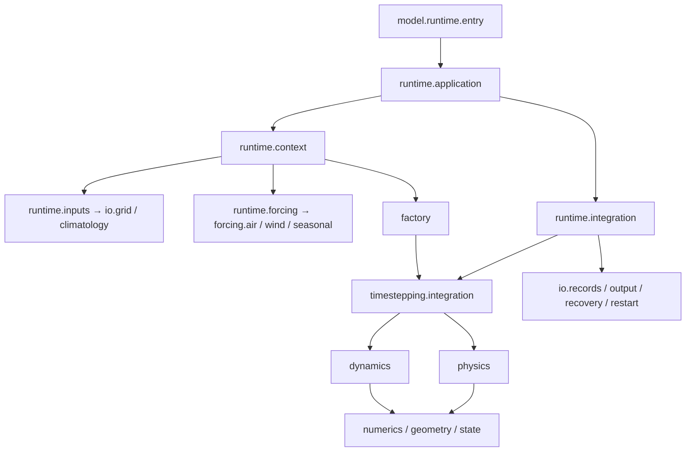

# 产品架构与正式模型

方法 ID 为 `zhenmode`，Python 包为 `zhenmode`。正式入口装配既有全球有限差分生产方法：静力原始方程、线性自由面、快慢步协调、投影及示踪物和物理过程。

## 产品边界

```text
src/zhenmode/
├── model/        正式模型及其输入、运行、诊断、输出和重启
├── baselines/    外部对照接入；mom6/ 集中代码、版本锁定和内置算例
├── execution/    配置展开、试验与扫参执行、独立 run 管理
├── evaluation/   评分、可比性检查和报告
├── provenance/   各能力共用的实际源码身份校验
└── cli.py        统一命令入口
```

顶层 `cases/`、`configs/`、`experiments/`、`protocols/` 分别定义共同问题、方法预设、具体试验和评价规则。它们不是 Python 实现，也不保存运行结果。MOM6 自身源码和编译产物使用隔离缓存。

`execution` 调用 `model` 或对照接入；`evaluation` 读取产物并可复用模型诊断。`model` 不导入 `execution`、`evaluation`、`baselines` 或统一 CLI，只依赖自身模块和共用源码身份工具。密度阈值混合层深度计算归属 `model/diagnostics/mixed_layer.py`，输入准备与评分使用同一既有诊断，独立测试参考计算保留。

## 运行流程



输入读取、时间循环和物理算子分别归属 IO、runtime 和过程模块。接受步循环管理状态、输出和恢复；`timestepping` 管理单步的过程次序与快慢步协调。
图中除入口外的模块名均相对于 `zhenmode.model`。

## 状态和离散约定

数组采用 `(nx, ny, nz)`。经度周期、纬度有界，垂向 z 向下为负。
`JaxStateG` 字段依次为 `u, v, T, S, eta, ice`；速度为 m/s，温度为 °C，盐度使用既有 psu 表达，自由面与冰厚为 m。

状态和网格类型使用实际所属模块名。线性自由面采用固定参考层厚语义，不自动解释为 `h_top=2.5+η` 的移动材料库存。研究候选的失败不能替代正式方法的稳定性证据。

工厂保留已有 opt-in 几何及时间方案接口，默认配置使用正式生产路径。FV/C-grid、材料库存和 r-star 原型属于本地研究工作区，不作为正式预设、安装或测试依赖。

## 来源与重启

运行记录包含最终配置、数据与实际执行源码身份。严格 checkpoint 核对网格、参数、强迫及执行源码；读取旧源码生成的 checkpoint 应使用相应源码版本，不通过路径别名或 hash 替换绕过身份检查。
Python 导入使用 `zhenmode.model.*`；旧 `ocean_solver.*` 包不再安装。状态字段、单位、数组顺序和数值公式保持，旧包名的 pickle 同样应在原版本读取。`ocean-solver` 控制台命令继续直连正式入口，没有复制实现。

## 验证

算子解析检查使用 `zhenmode mms`。生产测试覆盖状态、收支、输出、恢复、来源及故障注入；步骤见 [开发说明](development.md)。数值测试和 CI 不自动证明长期气候指标或加速优势。

## 模块职责

| 区域 | 所有者与职责 | 边界 |
| --- | --- | --- |
| `model/factory.py`, `model/runtime` | 工厂装配、模型 CLI、上下文、强迫绑定、接受步执行 | 不在应用层复制物理公式 |
| `config`, `state`, `geometry` | 物理参数定义、状态字段、固定参考库存语义、离散几何 | 数值状态与数据路径分离；不采用候选移动库存解释 |
| `numerics` | 后端、差分、插值、稳定性与数值基础 | 无文件读取或研究依赖 |
| `dynamics`, `physics`, `timestepping` | 动量/连续性/示踪物，参数化，完整步/快慢子步协调 | 公式和执行顺序保持；时间协调不藏在数据加载里 |
| `forcing`, `io` | 外部空气/风读取与插值，初值/浴深/输出/重启 | 加载不进入物理算子；数据默认引用路径 |
| `model/diagnostics`, `model/audit`, `provenance` | 保存指标、真实步预算、失败监测、实际执行来源 | 诊断/门槛不等于气候资格 |
| `model/validation/mms.py` | 解析制造解检查 | 算子验证不等于长期气候效果 |
| `evaluation` | 唯一评分实现与协议/比较/报告编排 | 旧 raw/A2 与面积 v2 不混排；共享网格，无隐含重网格 |
| `baselines/mom6` | 强迫转换、固定外部源/构建/运行/结果转换及内置定义 | 上游与编译缓存仓库外隔离 |
| `execution` | 配置校验与展开、有界运行、状态和结果索引 | 运行成功与评价验收分别记录 |
| `cases` | 共同问题、边界、强迫、输出、数据引用 | 物理不一致的运行不能因 case 标签相同而变成公平比较 |
| `configs/<method>/presets` | 多套来源明确的正式预设/历史复现配方 | 配方可展开不等于当前成绩已复现 |
| `experiments` | 有 ID 的试验、消融和扫参定义 | 只声明相对 case/preset 的变化；大扫参不自动执行 |
| `protocols` | 评价规则、版本、评分窗口与权重 | 不含评分实现或结果 |
| `outputs`, `data` | 独立 run 结果与本地输入缓存 | 默认忽略大文件，不覆盖已有结果 |
| `scripts`, `tests`, `docs` | 少量维护/验证入口，按合同测试，运行/方法说明 | 无第二套算法；旧脚本是否可删先查引用与复现用途 |

实验定义经配置校验与展开后调用生产入口。MOM6 在隔离缓存中获取、构建和运行，结果进入同一评价包；物理不一致的运行保留受限比较身份。正式包只使用所属模块的直接导入，不依赖历史路径映射。
