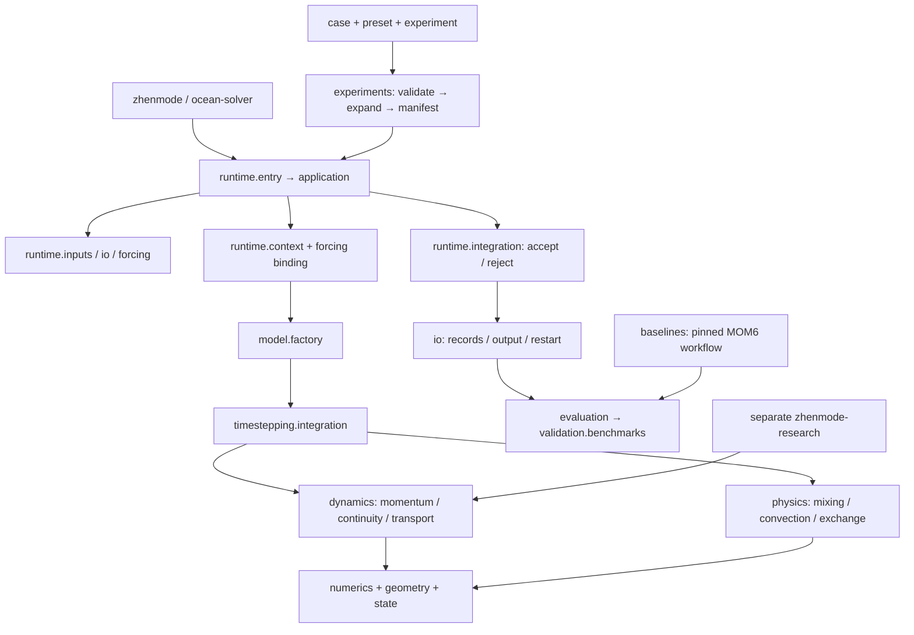

# ZhenMode 研究工程架构

实施基线是远端 main `25258950905f9d1aa84509c4c99ebad9ef33ba2b`。本地旧研究分支 `82e1ca4` 保留，独立分支为 `ttawdtt/zhenmode-research-engineering`。本次冻结了该 main 的完整 Git 快照、2008 个实际收集的测试节点、275 项非零小网格生产记录，以及 344 项连续运行和两次中断重启记录。实测结果和复现命令见 [当前工程验证报告](research_engineering_validation_zh.md)。

## 实际调用图与目标

箭头表示调用或依赖；正式包不反向导入研究包。默认方法唯一：既有全球经度周期、纬度截断、线性自由面的 FD 生产方法。已有 FD opt-in 参数不自动获得默认生产资格；材料库存、FV/C-grid、r-star 是研究方法。保留 `ocean_solver` 包名和 `ocean-solver` 命令，新增统一 `zhenmode` 命令。

## 职责与文件归属

| 区域 | 所有者与职责 | 边界 |
| --- | --- | --- |
| `src/ocean_solver/model`, `runtime` | 工厂装配、CLI、上下文、强迫绑定、接受步执行 | 不在应用层复制物理公式 |
| `config`, `state`, `geometry` | 物理参数定义、状态字段、固定参考库存语义、离散几何 | 数值状态与数据路径分离；不采用候选移动库存解释 |
| `numerics` | 后端、差分、插值、稳定性与数值基础 | 无文件读取或研究依赖 |
| `dynamics`, `physics`, `timestepping` | 动量/连续性/示踪物，参数化，完整步/快慢子步协调 | 公式和执行顺序保持；时间协调不藏在数据加载里 |
| `forcing`, `io` | 外部空气/风读取与插值，初值/浴深/输出/重启 | 加载不进入物理算子；数据默认引用路径 |
| `diagnostics`, `audit`, `provenance` | 保存指标、真实步预算、失败监测、实际执行来源 | 诊断/门槛不等于气候资格 |
| `validation/benchmarks`, `evaluation` | 唯一评分实现与协议/比较/报告编排 | 旧 raw/A2 与面积 v2 不混排；共享网格，无隐含重网格 |
| `interop/mom6`, `baselines` | 既有强迫转换、固定外部源/构建/运行/结果转换 | 上游与编译缓存仓库外隔离 |
| `cases` | 共同问题、边界、强迫、输出、数据引用 | 物理不一致的运行不能因 case 标签相同而变成公平比较 |
| `configs/<method>/presets` | 多套来源明确的正式预设/历史复现配方 | 配方可展开不等于当前成绩已复现 |
| `experiments` | 有 ID 的试验、消融和扫参定义 | 只声明相对 case/preset 的变化；大扫参不自动执行 |
| `outputs`, `data` | 独立 run 结果与本地输入缓存 | 默认忽略大文件，不覆盖已有结果 |
| `research/src/zhenmode_research` | 单独安装的未采用候选 | 正式 wheel 无候选实现或研究桥；开发全套测试另装 research |
| `research/experiments` | 既有研究协议、独立 oracle 与失败材料 | 保留失败身份，不用于生产自证 |
| `archive/evidence` | 可核查历史证据索引 | 指向原始 Git 对象，保留来源边界与字节校验 |
| `scripts`, `tests`, `docs` | 少量维护/验证入口，按合同测试，运行/方法说明 | 无第二套算法；旧脚本是否可删先查引用与复现用途 |

内部调用直接导入上述职责模块。原 `fd`/`data` 转接包、生产和研究 bare-module 别名、汇总门面及历史类型名伪装均已删除。只保留有使用价值的公共 CLI：`zhenmode` 和 `ocean-solver`。旧路径映射是复现元数据，不再是可导入接口。严格 checkpoint 仍校验实际执行文件；历史运行需检出原提交。详细删除依据见 [清理说明](cleanup_zh.md)。

## 依赖顺序与验证

先冻结源码、集合、代表性配置和生产数值记录；再按叶模块→过程→时间协调→装配→IO/运行组织。配置/实验与外部对照独立编排，通过共同结果/协议合同接线。最后验证测试集合保留、实际安装、数值记录、重启、错误拒绝和 README 命令。迁移表记录实际源路径，不以目录名称代替来源校验。

局地验证采用单 CPU、每次 180 秒、4 GiB。超时或错误保留为失败，分组重新验证时说明范围。MOM6 构建/运行、GPU、长积分另行报告资源；本次不重跑百年。工程回归通过只支持结构和既有小算例行为保持，不能建立新的气候精度、工业资格或加速结论。
