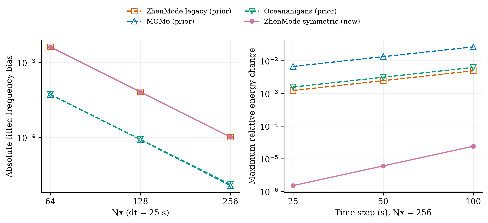
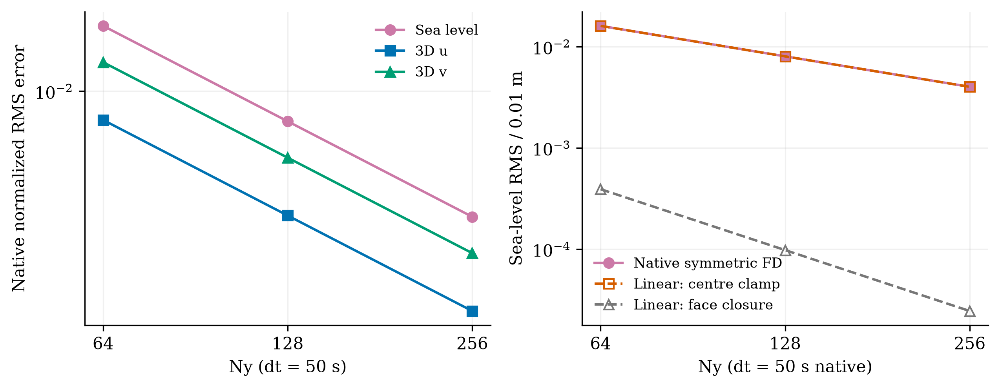

# 新外模的空间与时间误差

ZhenMode 的对称外模已完成五个驻波组合和三档旋转调整，共八个新的 GPU 原生运行。
本轮保持求解器、物理、初态、离散位置及预置筛选，扩展研究入口与分析器。
结论支持下一步优先核查封闭边界的速度表示及其压力／连续性／科氏耦合。

## 驻波控制

五个组合与[既有分离协议](wave_space_time_zh.md)相同：固定 dt=25 s 加密 nx，
固定 nx=256 改变 dt；交点只运行一次。积分一个 32000 s 周期，每 1000 s 保存瞬时状态。
海面和深均 u 使用原协议的归一化时空 RMS；能量为相对初值的最大变化，频率来自模态拟合。

| nx | dt (s) | 海面误差 | 深均 u 误差 | 能量变化 | 频率偏差 |
| --- | --- | --- | --- | --- | --- |
| 64 | 25 | 0.002859448 | 0.00296486 | 1.499938e-06 | -0.001605409 |
| 128 | 25 | 0.0007146009 | 0.0007421283 | 1.503566e-06 | -0.0004013475 |
| 256 | 25 | 0.0001800852 | 0.0001866341 | 1.50446e-06 | -0.0001001962 |
| 256 | 50 | 0.0001787602 | 0.0001854088 | 6.021553e-06 | -9.95981e-05 |
| 256 | 100 | 0.0001734621 | 0.0001805793 | 2.409029e-05 | -9.720568e-05 |

固定时间步时，海面误差和频率偏差随网格点数翻倍约缩小四倍；
固定网格时，时间步翻倍的能量变化比例分别为 4.00247 和 4.00068。
该能量指标在这段范围表现为近似 dt²，原方案在相同问题上近似随 dt 线性增加。
海面／速度误差随 dt 增大略降，而能量变化增大，提示空间与时间误差可能抵消；
不能用单项 RMS 的下降推荐更大的时间步，也不能从能量指标判定完整模式二阶。

左侧为频率拟合偏差绝对值，右侧为能量变化。新曲线来自本轮五个 FD 运行；
原 FD、MOM6 和 Oceananigans 曲线来自已保留的历史三方研究，各自源码和输出身份分别保存。
新旧 FD 的空间频率曲线几乎重合；图中分别使用实线实心标记与虚线空心标记。
历史运行不计入八个新运行，也不用于跨版本／硬件的性能排名。

## 旋转调整

旋转问题保持 nx=8、nz=4、dt=50 s、f=π/32000 s⁻¹及同一闭通道初态，
只将 ny 设为 64、128、256。参考、权重和完整网格评分见[机制定义](channel_dynamics_zh.md)。
三个分辨率的海面、三维 u/v 误差如下。

| ny | 海面误差 | 三维 u 误差 | 三维 v 误差 |
| --- | --- | --- | --- |
| 64 | 0.01607 | 0.008112908 | 0.01234037 |
| 128 | 0.008033182 | 0.004052785 | 0.006168294 |
| 256 | 0.004016399 | 0.002025964 | 0.003083888 |

旋转问题的三项误差随网格加密约缩小两倍，保持接近一阶的趋势。
周期方向的驻波与封闭方向的旋转问题表现不同，固定 dt 的三档结果把优先级指向空间耦合；
它们本身不能唯一地区分边界表示、科氏耦合和其他空间项。
八个新运行的原有工程筛选全部通过，未删除墙边格点或调整阈值。

左侧三条实线为实际 FD 误差。右侧紫线仍为实际海面误差，两条虚线是下述线性矩阵诊断。
它们的时间演化使用连续矩阵指数，灰线对应尚未接入完整 ZhenMode 的假设表示。

## 空间算子诊断

当前 FD 把实际通量墙面封闭，同时将最外两行格点中心的法向速度清零。
我们按已记录的面平均、面通量差、负伴随压力梯度及受约束科氏项写出线性矩阵，
用 SciPy 矩阵指数推进同一初态。该诊断绕开 JAX 时间步，但共享当前空间算子定义；
它用于定位机制，不能作为对完整求解器的独立认证。

| ny | 当前表示的线性海面误差 | 线性表示与原生海面的 RMS 差 | 仅封闭通量面的线性海面误差 |
| --- | --- | --- | --- |
| 64 | 0.01607 | 2.031202e-05 | 0.0003911326 |
| 128 | 0.008033162 | 2.042176e-05 | 9.77859e-05 |
| 256 | 0.00401635 | 2.049664e-05 | 2.444665e-05 |

当前表示的线性误差随加密约缩小两倍，并重现实际旋转误差的主要幅度；
原生海面与该线性轨迹的 RMS 差约为 2.1e−5，比实际旋转误差小。
假设取消格点中心的额外清零，仍在实际墙面令通量为零、保持压力负伴随及能量范数，
线性诊断误差随加密约缩小四倍。该结果支持优先改进墙面与格点速度之间的表示关系。
替代表示仅在矩阵诊断中检验，尚无完整非线性 ZhenMode 的改良运行。

矩阵诊断的控制包括质量守恒列和、斜对称能量范数、独立写出的离散正弦／余弦模态，
以及故意打开一个边界面的反例。正模态在 ny=16/32 的控制要求绝对差 ≤2e−14，
能量范数变化要求 <2e−12；漏面反例必须违反质量守恒检查。
这些控制是在查看八个实际结果后，为空间机制假设补充的诊断控制。
边缘两行在 ny=256 仅贡献约 0.86% 的海面误差平方，误差明显存在于内部。
分区统计不能单独分离墙面影响与内部离散项；正式评分仍保留全部格点。

## 下一项改动

下一项建议限定为封闭边界的速度表示：让真实墙面的无通量条件与格点位置一致，
同时保持三维状态约束、压力／连续性负伴随和科氏项一致。
实现后仍用本批问题比较，必须同时检验质量、能量、重启及墙面通量，
保留现有生产预设的数值谱系。此处提出的是修改依据，本轮没有替换求解器或生产默认。

## 来源与范围

八个运行使用提交 c0107e4 的固定 wheel，在仓库外安装；ZhenMode 仍为真实 CUDA／FP64。
每个原生进程一核 CPU、4 GiB 主机 RSS 采样阈值、600 s 外层时限，按顺序运行。
细驻波实际进程耗时 13.4305 s，初始化记录含编译时间；实际积分为 2.33732 s。
这些耗时说明此次工作在资源范围内，不构成对照模式速度排名。

入口／评分／完整性控制的有界测试为 99 项通过。[结果摘要](data/symmetric_resolution_20261010.json)
保存八个运行的指标、源程序身份、实际输出／合同／评分哈希、模态轨迹及线性诊断。
完整初态、时序、日志、安装 wheel 与控制记录保存在本机 `outputs/symmetric-mode-study-20261010/`。
数据用于方法诊断与后续选择，不能再用作该选择的独立认证；本轮也不授予全球气候或工业资格。
