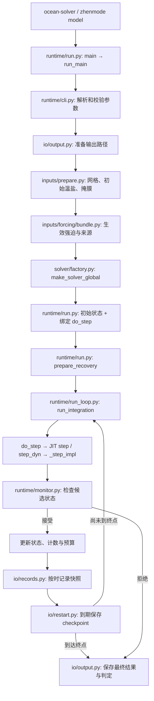

# ZhenMode 模型导读

## 1. 这是什么

`model` 是 ZhenMode 正式海洋模式的实现：把海洋划成网格，根据初始温度、盐度、海深和外部强迫，逐步计算海流、温盐、海面高度和海冰的变化。

正式默认方法沿用既有全球 **FD（Finite Difference，有限差分）** 生产主线，采用静力原始方程、线性自由面和快慢步协调，使用 JAX 执行数值计算。线性自由面使用固定参考层厚；海面高度 `eta` 不自动变成 `h_top = 2.5 + eta` 的移动表层库存。代码中的可选几何、输运和时间方案需要显式启用，不能据其存在推断正式预设采用了这些方案。

可以把整个模型理解成一次海洋模拟的五个部分：

| 部分 | 回答的问题 |
| --- | --- |
| `inputs/` | 海深、初始温盐和随时间变化的风、空气温度从哪里来，怎样变成模型可用的数组？ |
| `solver/` | 已知当前海洋状态，怎样算出下一个时间步？ |
| `runtime/` | 怎样组织整次模拟，何时推进、检查、保存或停止？ |
| `diagnostics/` | 当前海洋的热量、盐量、能量和混合层是什么情况，各阶段改变了多少？ |
| `io/` | 怎样保存结果、记录来源，并从可信的 checkpoint 恢复？ |

`model` 不负责 MOM6 的构建运行、实验配置继承或统一评分。这些分别属于同级的 [baselines/mom6](../baselines/mom6/README.md)、`execution` 和 `evaluation`。正式模型不反向依赖它们，也不依赖研究原型；共用源码身份与文件校验工具位于同级 `provenance`。

运行入口是 `ocean-solver`，也可以通过 `zhenmode model` 调用同一个入口。安装、小算例和真实数据要求见[仓库 README](../../../README.md)与[输入说明](../../../cases/README.md)。

## 2. 目录和文件各自负责什么

下面列出全部实现文件；各级 `__init__.py` 是 Python 包标记，不是另一套求解入口。

```text
model/
├── README.md
├── __init__.py
├── config.py
├── verification.py
├── solver/
│   ├── factory.py
│   ├── state.py
│   ├── geometry/
│   │   ├── grid.py
│   │   └── fd_metrics.py
│   ├── numerics/
│   │   ├── backend.py
│   │   ├── horizontal.py
│   │   └── vertical.py
│   ├── dynamics/
│   │   ├── tendencies.py
│   │   ├── transport.py
│   │   ├── pressure.py
│   │   ├── barotropic.py
│   │   └── projection.py
│   ├── physics/
│   │   ├── eos.py
│   │   ├── surface.py
│   │   ├── vertical.py
│   │   └── isopycnal.py
│   └── timestepping/
│       ├── step.py
│       └── subcycles.py
├── inputs/
│   ├── bathymetry.py
│   ├── initial_conditions.py
│   ├── sources.py
│   ├── quality.py
│   ├── prepare.py
│   └── forcing/
│       ├── reanalysis.py
│       ├── seasonal.py
│       ├── idealized.py
│       └── bundle.py
├── runtime/
│   ├── cli.py
│   ├── run.py
│   ├── run_loop.py
│   ├── monitor.py
│   └── reporting.py
├── diagnostics/
│   ├── snapshot.py
│   ├── mixed_layer.py
│   └── budgets.py
└── io/
    ├── records.py
    ├── output.py
    └── restart.py
```

### 顶层：配置与解析验证

| 文件 | 职责 |
| --- | --- |
| [config.py](config.py) | 定义网格配置、物理配置、物理常数及基本数值约束。仓库里的 YAML 继承、实验身份和单位契约由 `execution` 处理。 |
| [verification.py](verification.py) | 用预先给定的解析场检查差分算子的误差与收敛阶；`zhenmode mms` 调用这里。它不在正式时间循环里，也不代表整套模型的长期精度验证。 |

### `solver/`：把当前状态推进一个时间步

`solver` 是数值核心。它接收已经准备好的网格、参数、初值和强迫数组，不在物理算子里下载或读取原始数据。

| 文件或目录 | 职责 |
| --- | --- |
| [factory.py](solver/factory.py) | `make_solver_global` 校验网格和参数，组装掩膜、差分系数与物理系数，再绑定 JAX 时间步、状态初始化和诊断函数。JIT 实际编译在函数首次执行时发生。 |
| [state.py](solver/state.py) | 定义 `JaxStateG` 状态和 `FDPhysParams` 计算参数，以及完整状态的字节身份比较。状态包含 `u, v, T, S, eta, ice`。 |
| `geometry/` | 描述网格的位置、尺度、海深和有效水体：回答“在哪里算、一个格子多大”。 |
| `numerics/` | 提供各过程复用的差分、梯度、散度和通量工具：回答“怎样离散计算”。 |
| `dynamics/` | 实现动量、连续性、压力与温盐输运：回答“海水怎样运动并搬运物质”。 |
| `physics/` | 实现状态方程、表面交换和未解析尺度的混合、对流等参数化：回答“这些物理过程怎样影响状态”。 |
| `timestepping/` | 安排各过程的计算顺序、时间长度与快慢子步：回答“怎样从这一刻走到下一刻”。 |

三维状态数组按 `(nx, ny, nz)` 排列，经度周期、纬度有界，垂向坐标向下为负。速度单位为 m/s，温度为 °C，盐度沿用 psu 表达，海面高度和冰厚为 m。

| 文件 | 具体职责 |
| --- | --- |
| [geometry/grid.py](solver/geometry/grid.py) | 网格结构、水平与垂向几何、海陆及海底掩膜、海深映射和平滑、距岸距离、网格校验；处理数组几何，不负责打开 ETOPO 文件。 |
| [geometry/fd_metrics.py](solver/geometry/fd_metrics.py) | 将网格转成求解器使用的球面差分尺度、面积和垂向控制厚度等系数。 |
| [numerics/backend.py](solver/numerics/backend.py) | 集中 NumPy/JAX 导入和既有 JAX 双精度设置；具体状态精度仍由运行配置选择。 |
| [numerics/horizontal.py](solver/numerics/horizontal.py) | 水平导数、梯度、散度、扩散、湿面通量、纬向边界处理、极区滤波及扩散子步估算。 |
| [numerics/vertical.py](solver/numerics/vertical.py) | 非均匀垂向差分、海底虚拟值填充、界面扩散通量及通量散度。这里只提供数值工具，不决定混合系数。 |
| [dynamics/tendencies.py](solver/dynamics/tendencies.py) | 组合动量、温盐的变化率及分项，供时间积分和输出分析使用；调用输运与物理过程。 |
| [dynamics/transport.py](solver/dynamics/transport.py) | 水平和垂向输运、连续性推导的垂向速度、示踪物平流，以及选定方案的限幅和 FCT 输运。 |
| [dynamics/pressure.py](solver/dynamics/pressure.py) | 由密度计算静力压力及压力梯度，提供三维动量和外模所需的压力加速度。 |
| [dynamics/barotropic.py](solver/dynamics/barotropic.py) | 正压外模，即深度平均流与海面高度的快速演化；包含自由面连续性、外模子步及海面滤波。 |
| [dynamics/projection.py](solver/dynamics/projection.py) | 用有界迭代修正速度的水柱散度，提供投影系数和收敛控制。 |
| [physics/eos.py](solver/physics/eos.py) | EOS（状态方程）：按既有线性关系把温盐转成相对参考状态的密度异常。 |
| [physics/surface.py](solver/physics/surface.py) | 表面热量在混合层中的分配权重，以及生产动态海冰闭合和相关热盐交换。 |
| [physics/vertical.py](solver/physics/vertical.py) | 选择垂向混合系数与扩散形式，判断局地对流并计算相应通量；复用 `numerics/vertical.py`。 |
| [physics/isopycnal.py](solver/physics/isopycnal.py) | 沿等密度面的 Redi 混合和 Gent–McWilliams 涡旋参数化。 |
| [timestepping/step.py](solver/timestepping/step.py) | `_step_impl` 主时间步：组织线性半步、非线性更新、外模子步、边界处理和海冰更新；也包含显式启用的时间方案分支。 |
| [timestepping/subcycles.py](solver/timestepping/subcycles.py) | 共用子步执行器，按配置使用 Python 循环或 JAX `scan`，并支持阶段记账。 |

例如，“垂向混合”跨三个职责：`physics/vertical.py` 决定混合强弱，`numerics/vertical.py` 计算离散通量，`timestepping/step.py` 安排更新顺序与时长。共用函数按这类职责归属，不另建一个什么都放的工具目录。

### `inputs/`：准备初始海洋和整个运行期间的外部环境

输入不仅是起始环境，也包括持续作用的风、空气温度和热强迫。这里负责文件、数据格式、插值和来源；求解器负责这些输入产生的状态变化。

| 文件 | 职责 |
| --- | --- |
| [bathymetry.py](inputs/bathymetry.py) | 打开并读取 ETOPO 海深数据，结合 `geometry/grid.py` 构造模型网格。 |
| [initial_conditions.py](inputs/initial_conditions.py) | 读取 WOA 温盐，处理缺失值并插值到模型网格，生成初始场。 |
| [sources.py](inputs/sources.py) | 选择数据路径、识别显式格式、读取带类型的 NPZ 或 NetCDF 气候场，并绑定不可变输入字节快照。 |
| [quality.py](inputs/quality.py) | 只读审计 WOA 输入坐标、单位、缺失值及湿格支持，生成质量报告和掩膜；提供严格支持检查与质量报告包校验，不替数据补值。 |
| [prepare.py](inputs/prepare.py) | `load_grid_inputs` 组织本次运行的网格、温盐初值、区域掩膜、混合层和物理参数准备。 |
| `forcing/` | 读取、构造并按模拟时间提供外部强迫。 |
| [forcing/reanalysis.py](inputs/forcing/reanalysis.py) | NCEP 风和空气温度数据的获取、缓存、读取与空间插值；将风速转成风应力。 |
| [forcing/seasonal.py](inputs/forcing/seasonal.py) | 组织月风场、空间平滑，以及重复 360 天历法下的月际混合；保留 NumPy 与 JAX 两种时间插值实现。 |
| [forcing/idealized.py](inputs/forcing/idealized.py) | 构造理想化热通量和空气温度分布，提供空间渐消等辅助处理。 |
| [forcing/bundle.py](inputs/forcing/bundle.py) | `load_forcing` 组装实际生效的强迫与来源；`ForcingBundle.bind_step` 把模拟时间和当时的强迫绑定到时间步函数。 |

### `runtime/`：组织整次运行

这里管准备、恢复、循环和失败处理。它调用求解器推进状态，不重写动力方程。

| 文件 | 职责 |
| --- | --- |
| [cli.py](runtime/cli.py) | 解析直接模型运行的命令参数，应用生产默认值并校验组合，计算请求的总步数。 |
| [run.py](runtime/run.py) | 正式入口和装配中心：连接真实输入服务、求解器、时间强迫及严格恢复，最后交给运行循环。 |
| [run_loop.py](runtime/run_loop.py) | 每步先计算候选状态，再检查并接受或拒绝；更新已接受步记录，按时保存快照和 checkpoint，最终判定并保存运行结果。 |
| [monitor.py](runtime/monitor.py) | 检查非有限值、速度与海面高度阈值等，返回明确的失败代码；被拒绝的状态不会冒充已接受状态。 |
| [reporting.py](runtime/reporting.py) | 输出运行配置、进度和诊断说明，并把控制台输出同时写入日志。 |

### `diagnostics/`：海洋的仪表盘和账本

诊断从状态计算有物理含义的量；统一评价则进一步按参考数据和协议判断误差与可比性，两者职责不同。

| 文件 | 职责 |
| --- | --- |
| [snapshot.py](diagnostics/snapshot.py) | 用 NumPy 计算状态快照的热量、盐量、动能等诊断，并转换为可保存的历史数组。 |
| [mixed_layer.py](diagnostics/mixed_layer.py) | 按密度阈值计算混合层深度，供初始化中的混合设置和外部分析使用；因此诊断也可以反馈物理参数准备。 |
| [budgets.py](diagnostics/budgets.py) | 记录已接受阶段的库存变化、已实现的通量项和累计预算；开启预算审计时，额外执行带记账的影子步并核对状态身份。 |

预算记录不等于所有物理库存都已独立闭合。当前最终输出仍明确保存 `physical_budget_closed=False`；影子步身份核对也不能替代独立解析解或观测验证。

### `io/`：保存运行产物和可信恢复

这里的 IO 是输出与重启；原始海深、WOA 和强迫文件的读取属于 `inputs`。

| 文件 | 职责 |
| --- | --- |
| [records.py](io/records.py) | 管理诊断历史、计数和三维快照，维护保存字段映射；恢复时独立核验历史、时刻和保留的输出文件。 |
| [output.py](io/output.py) | 准备输出路径，记录最终生效配置、状态、诊断、来源与运行判定，生成最终 NPZ；拒绝覆盖已有最终结果。 |
| [restart.py](io/restart.py) | checkpoint 契约、指纹、编解码与严格核验；共用原子归档写入，checkpoint 原子替换，最终结果原子发布且不覆盖。 |

## 3. 模型运行的链路

### 整次模拟：入口 → 准备 → 装配 → 恢复 → 循环 → 保存



按实际函数阅读时，主线是：

1. `runtime/run.py: main → run_main` 调用 `parse_run_configuration`，准备输出位置；严格强迫模式先检查本地输入是否齐全。
2. `build_run_context` 依次调用 `load_grid_inputs`、`load_forcing` 和 `assemble_solver`。输入读取在这一阶段完成；求解器得到的是已准备的数据。
3. `assemble_solver` 调用 `make_solver_global`，创建初始状态，并通过 `ForcingBundle.bind_step` 得到统一的 `do_step(state, day)`。固定强迫调用 `step`；季节强迫先取当前月份与混合权重，再调用 `step_dyn`。
4. `prepare_recovery` 确定总步数、快照与 checkpoint 节奏。续跑时，`load_restart` 核对网格、参数、强迫和实际执行源码，`records.py` 再核验保留历史与输出，随后恢复状态和计数。
5. `run_integration` 先检查进入循环的状态，再逐步调用 `do_step`。候选状态通过监测才成为新状态；启用预算审计时，还需通过影子步身份及预算有限性检查。
6. 循环按配置保存诊断、可选三维场及 checkpoint，结束时调用 `write_final_records`。结果明确区分 `PASS`、失败和 `INCOMPLETE`；这里的 `PASS` 是运行监测判定，RMSE、物理效果和公平成本比较还需交给 `evaluation`。

通过实验命令运行时，外层 `execution` 先展开 case、preset 和 overrides，分配独立 run ID、记录状态，再由 worker 接入这条模型主线。模型内部不自行处理 YAML 继承或组织扫参。

### 一个时间步：过程计算 → 快慢协调 → 边界与海冰

`solver/factory.py` 返回的 JIT 函数最终都调用 `solver/timestepping/step.py` 的 `_step_impl`。在正式全球预设启用的快慢步路径上（`mode_split=True`），它依次执行：

1. **线性半步**：处理扩散、海绵层和科氏旋转等，推进半个慢时间步。
2. **非线性整步**：组合动量、压力、温盐输运与物理源项，推进一个慢时间步。
3. **第二个线性半步**：完成线性／非线性／线性的分裂积分。
4. **外模快速子步**：用更短步长更新深度平均流和自由面，再把深度平均速度的改变量投回三维速度。
5. **边界与海冰处理**：应用极区滤波，保留陆地及海底虚拟层的既有值，约束南北边界法向速度，再执行动态海冰闭合。

这些阶段调用 `dynamics` 和 `physics`；它们再复用 `numerics`、`geometry` 和 `state`。可选方案在 `step.py` 中有显式分支，不能把这份生产流程当作所有 opt-in 方案的执行顺序。直接 CLI 的 `--mode-split` 是显式开关；裸命令不会自动加载正式 YAML 预设，复现实验应使用相应实验定义或完整参数。

第一次读代码，可以沿 **[run.py](runtime/run.py) → [prepare.py](inputs/prepare.py) / [bundle.py](inputs/forcing/bundle.py) → [factory.py](solver/factory.py) → [run_loop.py](runtime/run_loop.py) → [step.py](solver/timestepping/step.py)** 阅读；遇到具体过程，再进入相应动力或物理文件。整个产品的边界见[方法与架构](../../../docs/production_architecture_zh.md)，验证与恢复限制见[开发说明](../../../docs/development.md)。
